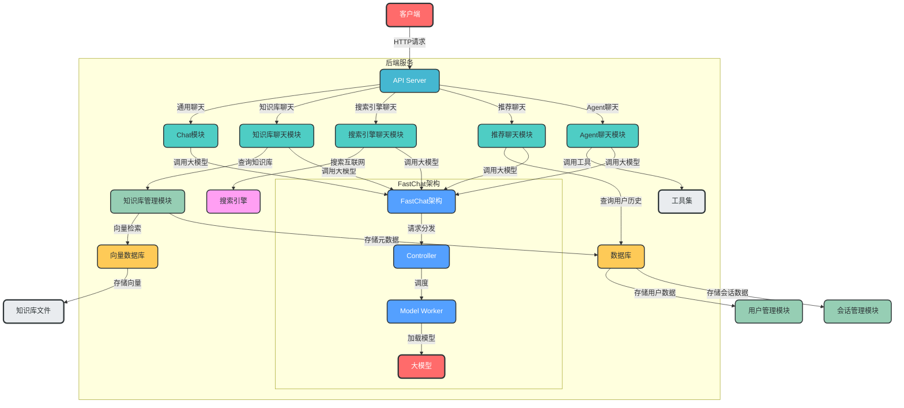
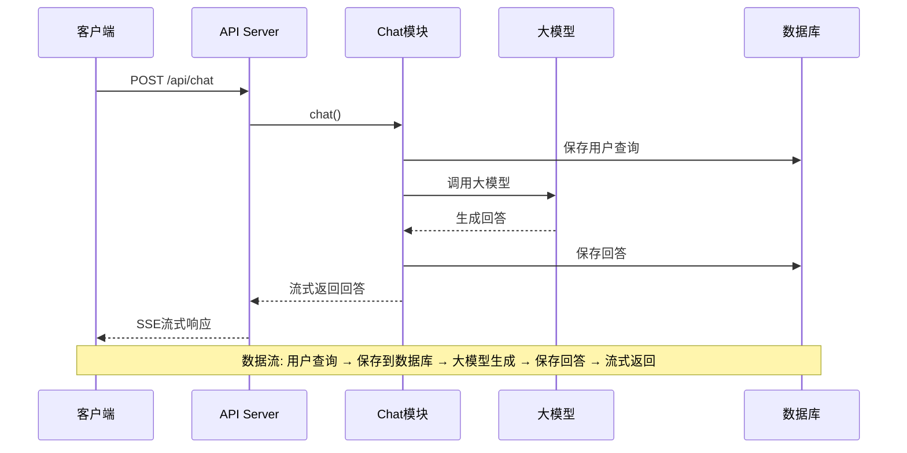
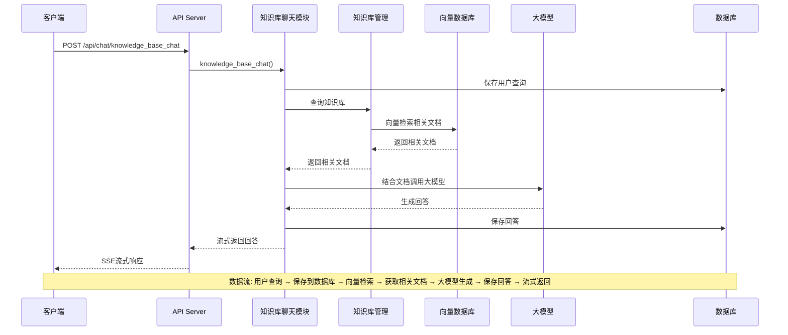
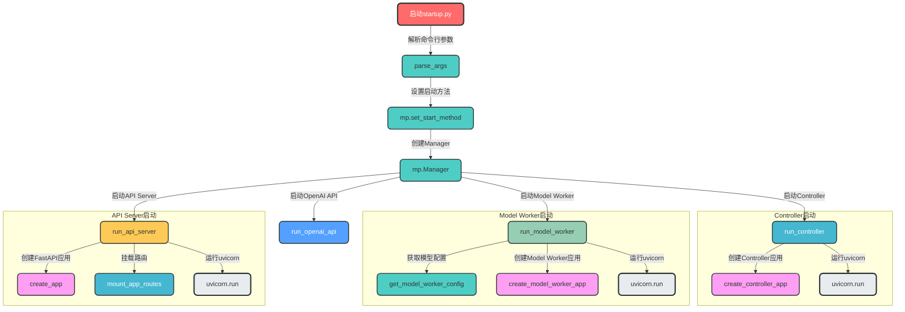
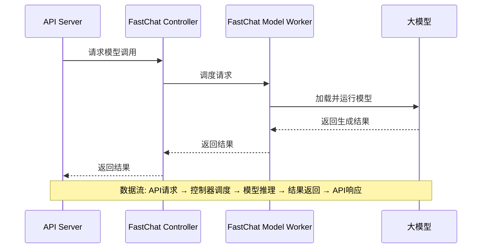
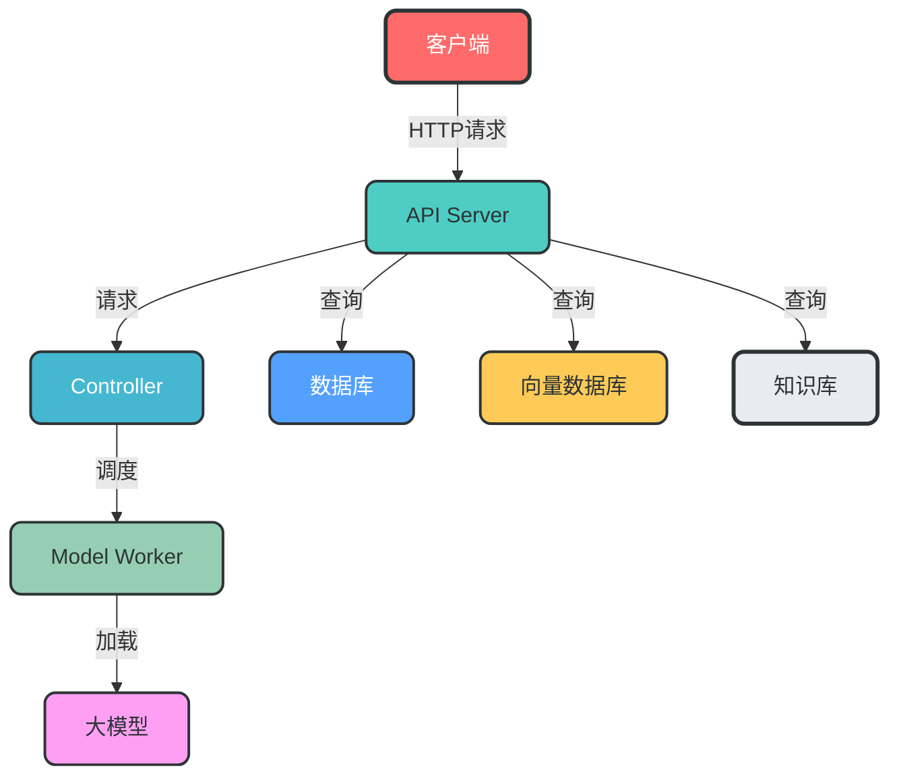
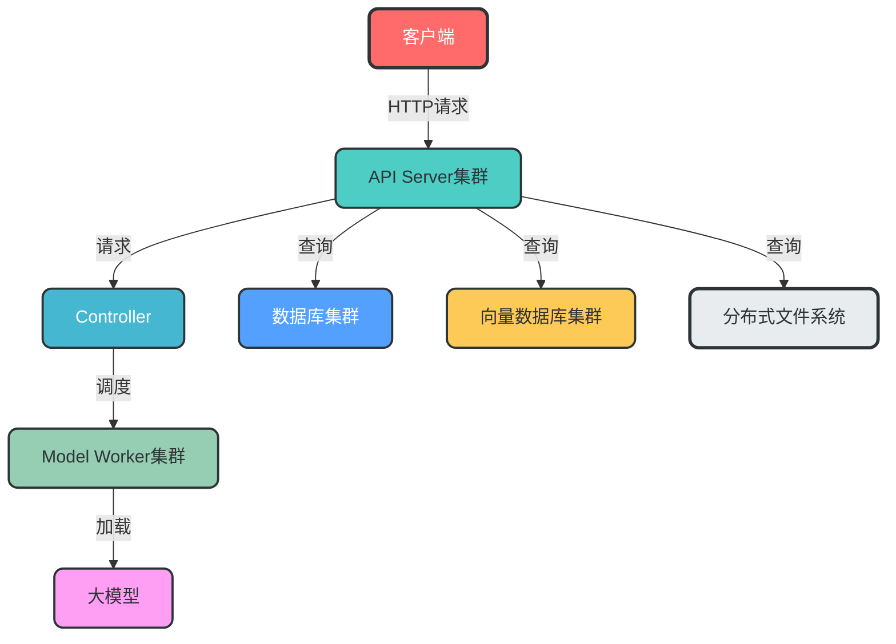

# Fufan Chat API 项目架构分析

## 1. 项目概述

Fufan Chat API 是一个基于大模型技术的智能问答系统，实现了多种核心场景的智能问答功能。项目采用了前后端分离设计，后端使用 Python 开发，前端使用 Vue3 框架。

### 1.1 核心功能

- **通用领域知识问答**：基于大模型的直接对话能力
- **本地私有知识库问答**：结合本地知识库内容生成回答
- **实时互联网搜索问答**：结合搜索引擎结果生成回答
- **AI Agents 问答**：使用智能代理生成回答
- **大模型推荐系统**：基于用户历史生成推荐

### 1.2 技术栈

- **后端框架**：FastAPI
- **大模型框架**：FastChat
- **向量数据库**：Faiss、Milvus
- **关系数据库**：MySQL
- **大模型**：ChatGLM3-6B、GLM4-9B-Chat 等
- **前端**：Vue3

## 2. 系统架构

### 2.1 整体架构图



### 2.2 模块说明

| 模块 | 主要职责 | 文件位置 |
|------|----------|----------|
| API Server | 提供API接口，处理HTTP请求 | `server/api_router.py` |
| Chat模块 | 处理通用聊天请求 | `server/chat/chat.py` |
| 知识库聊天模块 | 处理结合知识库的聊天请求 | `server/chat/knowledge_base_chat.py` |
| 搜索引擎聊天模块 | 处理结合搜索引擎的聊天请求 | `server/chat/search_engine_chat.py` |
| 推荐聊天模块 | 处理推荐相关的聊天请求 | `server/chat/recommendation_chat.py` |
| Agent聊天模块 | 处理Agent相关的聊天请求 | `server/chat/agent_chat.py` |
| 知识库管理模块 | 管理和查询知识库 | `server/knowledge_base/` |
| FastChat架构 | 管理和运行大模型 | `fastchat/serve/` |
| 向量数据库 | 存储和检索向量数据 | `server/knowledge_base/kb_service/` |
| 数据库 | 存储用户、会话和知识库元数据 | `server/db/` |
| 用户管理模块 | 管理用户信息和权限 | `server/db/repository/user_repository.py` |
| 会话管理模块 | 管理会话和消息 | `server/db/repository/conversation_repository.py` |

## 3. 核心流程

### 3.1 通用聊天流程



### 3.2 知识库聊天流程



### 3.3 系统启动流程



## 4. 配置管理

### 4.1 配置文件说明

| 配置文件 | 主要职责 |
|----------|----------|
| `basic_config.py` | 基础配置，如日志格式、日志路径 |
| `model_config.py` | 模型配置，如使用的模型、模型路径、向量数据库配置 |
| `server_config.py` | 服务器配置，如各服务的端口、主机、设备配置 |
| `prompt_config.py` | 提示词配置，各种聊天场景的提示词模板 |
| `kb_config.py` | 知识库配置，如知识库存储路径、向量数据库配置 |

### 4.2 关键配置项

#### 模型配置

```python
# 默认启动的模型
LLM_MODELS = ["chatglm3-6b"]

# 模型路径配置
MODEL_PATH = {
    "local_model": {
        "glm4-9b-chat": r"E:\github_project\models\chatglm4-9b-chat",
        "chatglm3-6b": r"E:\github_project\models\chatglm3-6b",
    },
    "embed_model": {
        "bge-large-zh-v1.5": r"E:\github_project\models\bge-large-zh-v1.5",
        "m3e-base": r"E:\github_project\models\m3e-base",
    },
    "reranker": {
        "bge-reranker-large": r"E:\github_project\models\bge-reranker-large",
    },
}
```

#### 服务器配置

```python
# API Server 配置
API_SERVER = {
    "host": DEFAULT_BIND_HOST,
    "port": 8000,
}

# FastChat Controller 配置
FSCHAT_CONTROLLER = {
    "host": DEFAULT_BIND_HOST,
    "port": 20001,
    "dispatch_method": "shortest_queue",
}

# FastChat Model Worker 配置
FSCHAT_MODEL_WORKERS = {
    "default": {
        "host": DEFAULT_BIND_HOST,
        "port": 20002,
        "device": LLM_DEVICE,
    },
    "chatglm3-6b": {
        "device": "cuda",
    },
}
```

## 5. API 接口设计

### 5.1 聊天相关接口

| 接口 | 方法 | 路径 | 功能 |
|------|------|------|------|
| 通用聊天 | POST | /api/chat | 大模型对话交互接口 |
| 知识库聊天 | POST | /api/chat/knowledge_base_chat | 与知识库对话 |
| 搜索引擎聊天 | POST | /api/chat/search_engine_chat | 与搜索引擎对话 |
| 推荐聊天 | POST | /api/chat/recommend_chat | 基于大模型的推荐 |
| Agent 聊天 | POST | /api/chat/agent_chat | AI Agents 对话能力 |

### 5.2 用户和会话管理接口

| 接口 | 方法 | 路径 | 功能 |
|------|------|------|------|
| 用户注册 | POST | /api/users/register | 用户注册 |
| 用户登录 | POST | /api/users/login | 用户登录 |
| 新建会话 | POST | /api/conversations | 新建会话 |
| 获取会话列表 | GET | /api/users/{user_id}/conversations | 获取用户会话列表 |
| 删除会话 | DELETE | /api/conversations/{conversation_id} | 删除会话及其消息 |
| 更新会话名称 | PUT | /api/conversations/{conversation_id}/update_name | 更新会话名称 |
| 获取会话消息 | GET | /api/conversations/{conversation_id}/messages | 获取会话消息列表 |

### 5.3 模型和知识库管理接口

| 接口 | 方法 | 路径 | 功能 |
|------|------|------|------|
| 获取已加载模型 | GET | /api/llm_model/list_running_models | 列出当前已加载的模型 |
| 获取知识库列表 | GET | /api/knowledge-bases/{user_id} | 获取知识库列表 |
| 创建知识库 | POST | /api/knowledge_base/create_knowledge_base | 创建知识库 |
| 删除知识库 | DELETE | /api/knowledge_base/delete_knowledge_base | 删除知识库 |
| 获取知识库文件列表 | GET | /api/knowledge_base/list_files | 获取知识库内的文件列表 |

## 6. 数据管理

### 6.1 数据库设计

#### 用户表
- 用户ID
- 用户名
- 密码（加密存储）
- 邮箱
- 创建时间
- 更新时间

#### 会话表
- 会话ID
- 用户ID
- 会话名称
- 创建时间
- 更新时间

#### 消息表
- 消息ID
- 会话ID
- 消息内容
- 消息类型（用户/系统）
- 创建时间

#### 知识库表
- 知识库ID
- 知识库名称
- 描述
- 创建用户ID
- 创建时间
- 更新时间

#### 知识库文件表
- 文件ID
- 知识库ID
- 文件名
- 文件路径
- 上传时间

### 6.2 向量数据库

- **Faiss**：轻量级向量数据库，适合中小型知识库
- **Milvus**：分布式向量数据库，适合大型知识库

## 7. 大模型集成

### 7.1 FastChat 架构

FastChat 是一个用于部署和服务大模型的开源框架，主要包含以下组件：

1. **Controller**：核心组件，负责管理和调度 Model Worker
2. **Model Worker**：负责加载和运行大模型
3. **OpenAI API**：提供 OpenAI 兼容的 API 接口

### 7.2 模型调用流程



### 7.3 支持的模型

- **本地模型**：ChatGLM3-6B、GLM4-9B-Chat 等
- **在线模型**：通过 API 调用的模型，如智谱 AI、OpenAI 等

## 8. 部署架构

### 8.1 单机部署



### 8.2 分布式部署



## 9. 性能优化

1. **模型优化**：
   - 使用模型量化（如 8-bit 或 4-bit 量化）
   - 模型并行和流水线并行
   - 模型缓存

2. **查询优化**：
   - 向量索引优化
   - 知识库分块优化
   - 查询缓存

3. **并发优化**：
   - 异步处理
   - 多进程/多线程
   - 连接池

4. **存储优化**：
   - 向量压缩
   - 数据分片
   - 冷热数据分离

## 10. 安全性考虑

1. **用户认证和授权**：
   - JWT 令牌认证
   - 基于角色的访问控制
   - 密码加密存储

2. **数据安全**：
   - 知识库访问权限控制
   - 数据加密传输
   - 敏感数据过滤

3. **API 安全**：
   - 请求速率限制
   - 输入验证和过滤
   - CORS 配置

4. **模型安全**：
   - 防止模型滥用
   - 输出内容审核
   - 防止注入攻击

## 11. 总结

Fufan Chat API 是一个功能丰富、架构清晰的智能问答系统，具有良好的扩展性和灵活性。系统采用了模块化设计，各组件之间职责明确，便于维护和扩展。通过集成 FastChat 架构，系统可以灵活支持多种大模型，包括本地模型和在线模型。

系统的核心优势在于：

1. **模块化设计**：各功能模块独立，便于维护和扩展
2. **多种聊天模式**：支持通用聊天、知识库聊天、搜索引擎聊天、推荐聊天和 Agent 聊天
3. **灵活的模型集成**：支持多种大模型，包括本地模型和在线模型
4. **完善的知识库管理**：支持 Faiss 和 Milvus 向量数据库
5. **良好的用户体验**：支持流式输出，实时返回结果
6. **完整的用户和会话管理**：便于跟踪和管理用户交互

通过合理的部署和优化，系统可以在不同规模的环境中稳定运行，满足各种智能问答需求。