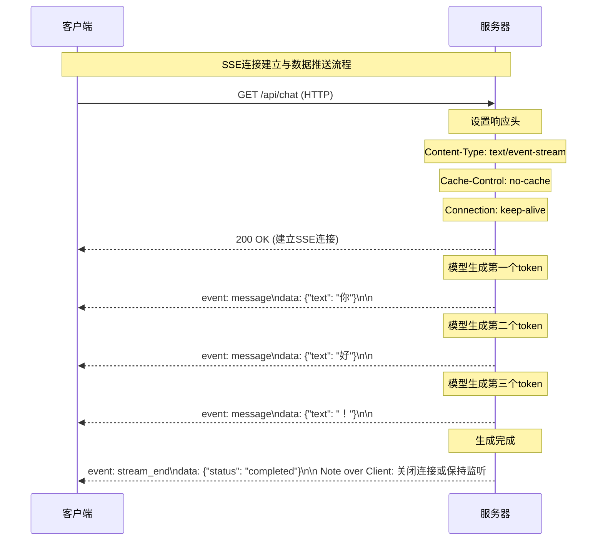
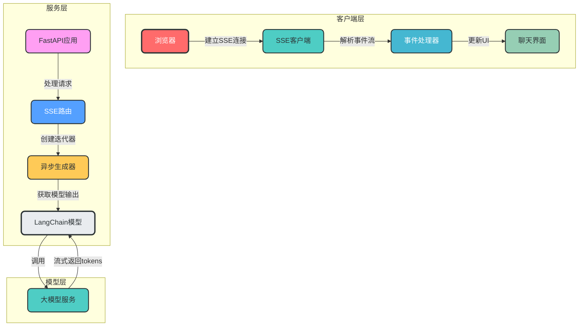
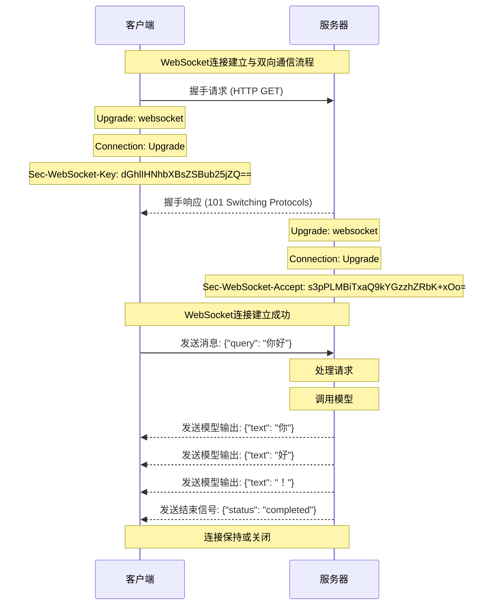
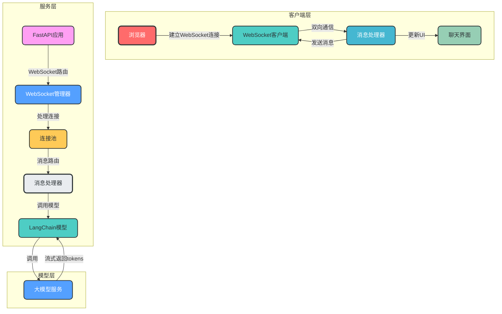
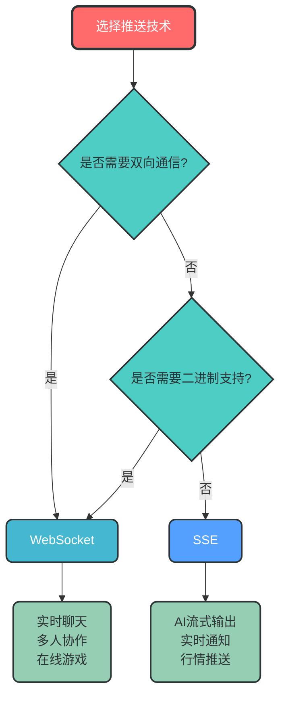
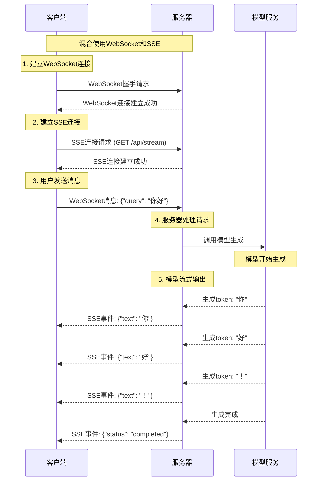
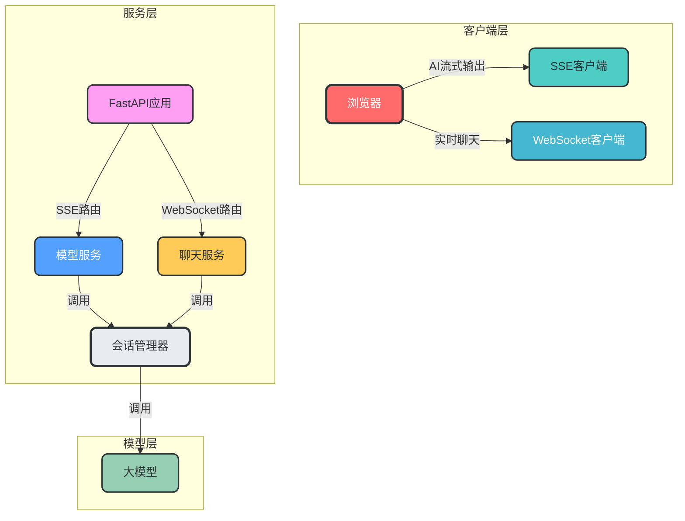

# SSE与WebSocket技术详解

## 1. 概述

### 1.1 什么是服务器推送技术

服务器推送技术是指服务器主动向客户端发送数据的技术，无需客户端发起请求。这种技术打破了传统HTTP协议的"请求-响应"模式，实现了真正的实时通信。

### 1.2 常见应用场景

| 场景 | 特点 | 推荐技术 |
|------|------|----------|
| AI模型流式输出 | 单向、文本流、低延迟 | SSE 或 WebSocket |
| 实时聊天 | 双向、频繁交互 | WebSocket |
| 实时通知 | 单向、突发消息 | SSE |
| 股票行情 | 单向、高频数据 | SSE 或 WebSocket |
| 多人协作 | 双向、复杂交互 | WebSocket |

## 2. SSE (Server-Sent Events) 详解

### 2.1 核心概念

SSE是一种基于HTTP的服务器推送技术，允许服务器通过单一HTTP连接向客户端持续推送数据。

### 2.2 工作原理



### 2.3 架构设计



### 2.4 数据格式

SSE使用简单的文本格式传输数据，每条消息由一个或多个字段组成：

```
event: message          # 事件类型
id: 12345               # 消息ID
data: {"text": "Hello"}  # 消息数据
retry: 5000             # 重连间隔(毫秒)

# 空行表示消息结束
```

### 2.5 项目应用

在本项目中，SSE主要用于AI模型的流式输出：

```python
# 项目中SSE的实现示例
from sse_starlette.sse import EventSourceResponse

async def chat_iterator():
    # 获取模型流式输出
    async for token in model_stream:
        # 推送SSE事件
        yield json.dumps({"text": token})

return EventSourceResponse(chat_iterator())
```

## 3. WebSocket详解

### 3.1 核心概念

WebSocket是一种基于TCP的全双工通信协议，允许服务器和客户端之间进行双向实时通信。

### 3.2 工作原理



### 3.3 架构设计



### 3.4 数据格式

WebSocket支持两种数据格式：
- **文本数据**：UTF-8编码的字符串
- **二进制数据**：ArrayBuffer或Blob对象

### 3.5 项目应用

```python
# 项目中WebSocket的潜在实现
from fastapi import WebSocket

class ConnectionManager:
    def __init__(self):
        self.active_connections: list[WebSocket] = []
    
    async def connect(self, websocket: WebSocket):
        await websocket.accept()
        self.active_connections.append(websocket)
    
    async def send_personal_message(self, message: str, websocket: WebSocket):
        await websocket.send_text(message)

manager = ConnectionManager()

@app.websocket("/ws/chat")
async def websocket_endpoint(websocket: WebSocket):
    await manager.connect(websocket)
    # 处理WebSocket通信
    while True:
        data = await websocket.receive_text()
        # 调用模型并发送流式输出
        async for token in model_stream:
            await websocket.send_text(json.dumps({"text": token}))
```

## 4. SSE与WebSocket技术对比

### 4.1 核心对比

| 特性 | SSE | WebSocket |
|------|-----|-----------|
| **通信方向** | 单向 (服务器→客户端) | 双向 (服务器↔客户端) |
| **基于协议** | HTTP | TCP |
| **连接建立** | 简单HTTP请求 | 握手协议升级 |
| **数据格式** | 文本 (事件流) | 文本或二进制 |
| **自动重连** | 内置支持 | 需要手动实现 |
| **跨域支持** | 基于CORS | 原生支持 |
| **实现复杂度** | 简单 | 复杂 |
| **资源消耗** | 低 | 中高 |
| **浏览器支持** | IE不支持 | 广泛支持 |

### 4.2 性能对比

```mermaid
bar chart
    title SSE与WebSocket性能对比
    x-axis 性能指标
    y-axis 相对值
    bar SSE "连接建立时间" 100
    bar WebSocket "连接建立时间" 150
    bar SSE "内存占用" 100
    bar WebSocket "内存占用" 200
    bar SSE "CPU使用率" 100
    bar WebSocket "CPU使用率" 180
    bar SSE "延迟" 120
    bar WebSocket "延迟" 100
```

### 4.3 适用场景对比



## 5. 项目应用建议

### 5.1 当前项目的技术选择

基于项目特点，**当前使用SSE是合理的**，理由如下：

1. **单向通信为主**：项目主要是模型输出→客户端，无需复杂的双向通信
2. **实现简单**：SSE实现简单，易于维护
3. **资源消耗低**：适合大规模部署
4. **客户端兼容性好**：除IE外，所有现代浏览器都支持

### 5.2 未来扩展建议

| 场景 | 推荐技术 | 实现建议 |
|------|----------|----------|
| AI流式输出 | SSE | 保持现有实现，优化事件格式 |
| 实时聊天功能 | WebSocket | 添加WebSocket支持，实现双向通信 |
| 多模型并发输出 | SSE + 自定义事件 | 使用不同事件类型区分不同模型输出 |
| 长连接管理 | SSE + 心跳机制 | 添加定期心跳事件，检测连接状态 |

### 5.3 混合使用方案

混合使用方案是指在同一系统中同时使用SSE和WebSocket，各自负责不同的通信场景。例如：用户发送消息使用WebSocket，模型输出结果使用SSE。

#### 5.3.1 技术可行性

**是的，技术上可以实现：用户发送消息使用WebSocket，模型输出结果使用SSE**。这种混合使用方案结合了两种技术的优势：

- **WebSocket**：处理客户端→服务器的双向通信（用户发送消息）
- **SSE**：处理服务器→客户端的单向流式输出（模型生成结果）

#### 5.3.2 工作流程



#### 5.3.3 架构设计



#### 5.3.4 优缺点分析

##### 优点
| 优势 | 说明 |
|------|------|
| **双向通信优化** | WebSocket适合频繁的客户端→服务器通信，避免HTTP请求的开销 |
| **流式输出高效** | SSE适合服务器→客户端的单向流式输出，实现简单，资源消耗低 |
| **自动重连机制** | SSE内置自动重连，无需手动实现 |
| **技术互补** | 结合两种技术的优势，适应不同通信场景 |

##### 缺点
| 缺点 | 说明 |
|------|------|
| **实现复杂度增加** | 需要维护两种连接，增加开发和维护成本 |
| **会话管理复杂** | 需要确保WebSocket和SSE连接关联到同一个用户会话 |
| **资源消耗增加** | 同时维护两种连接，增加服务器资源消耗 |
| **客户端兼容性** | 需要考虑浏览器对两种技术的支持情况 |

#### 5.3.5 实现建议

##### 连接管理
```python
# 示例：会话管理机制
from fastapi import WebSocket

class SessionManager:
    def __init__(self):
        self.sessions = {}  # session_id -> {"ws": WebSocket, "sse_clients": list}
    
    async def add_websocket(self, session_id: str, websocket: WebSocket):
        if session_id not in self.sessions:
            self.sessions[session_id] = {"ws": websocket, "sse_clients": []}
        else:
            self.sessions[session_id]["ws"] = websocket
    
    async def add_sse_client(self, session_id: str, sse_client):
        if session_id not in self.sessions:
            self.sessions[session_id] = {"ws": None, "sse_clients": [sse_client]}
        else:
            self.sessions[session_id]["sse_clients"].append(sse_client)
```

##### 适用场景
这种混合使用方案适合：
1. **复杂交互场景**：需要频繁的客户端→服务器通信，同时需要高效的流式输出
2. **多模块协作**：不同功能模块使用不同的通信方式
3. **渐进式优化**：在现有SSE基础上，逐步引入WebSocket功能
4. **特定性能需求**：某些场景下需要WebSocket的低延迟双向通信

## 6. 最佳实践

### 6.1 SSE最佳实践

1. **合理设置事件类型**：使用不同事件类型区分不同数据
2. **添加消息ID**：便于客户端恢复连接
3. **设置合理的重连间隔**：避免频繁重连
4. **优化数据格式**：使用轻量级JSON格式，减少数据大小
5. **实现连接管理**：添加心跳机制，检测连接状态

### 6.2 WebSocket最佳实践

1. **实现心跳机制**：定期发送心跳包，检测连接状态
2. **添加重连逻辑**：处理网络中断情况
3. **优化消息大小**：合并小消息，减少网络开销
4. **实现连接池**：管理大量并发连接
5. **添加认证授权**：确保连接安全性

### 6.3 通用最佳实践

1. **监控连接状态**：实时监控连接数、延迟等指标
2. **实现限流机制**：防止恶意连接
3. **添加日志记录**：便于调试和问题排查
4. **考虑降级方案**：在不支持的环境下提供替代方案
5. **定期测试性能**：确保系统在高负载下正常运行

## 7. 总结

SSE和WebSocket都是实现实时通信的重要技术，各有优缺点和适用场景。在本项目中，SSE是实现AI模型流式输出的理想选择，具有实现简单、资源消耗低等优点。

随着项目的发展，如果需要实现实时聊天、多人协作等双向通信功能，可以考虑引入WebSocket或混合使用两种技术。

选择合适的推送技术需要根据具体业务需求、性能要求和开发成本等因素综合考虑，以达到最佳的用户体验和系统性能。

## 8. 参考资料

1. [MDN Web Docs - Server-Sent Events](https://developer.mozilla.org/en-US/docs/Web/API/Server-sent_events)
2. [MDN Web Docs - WebSocket](https://developer.mozilla.org/en-US/docs/Web/API/WebSocket)
3. [FastAPI Documentation](https://fastapi.tiangolo.com/advanced/websockets/)
4. [SSE Starlette Documentation](https://github.com/sysid/sse-starlette)
5. [WebSocket Protocol Specification](https://datatracker.ietf.org/doc/html/rfc6455)
