# Faiss向量数据库初始化流程详解

## 1. 项目背景与目的

在RAG（检索增强生成）系统中，向量数据库是核心组件之一，用于存储和检索文档向量。本项目中，我们需要初始化Faiss向量数据库，将PDF和JSONL文档转换为向量并存储。

### 1.1 核心脚本对比

| 脚本 | 设计思路 | 特点 |
|------|----------|------|
| `init_vs.py` | 复杂异步设计 | 依赖异步缓存机制，容易引发内存错误 |
| `init_faiss_sync.py` | 简化同步设计 | 直接使用LangChain FAISS接口，避免复杂依赖 |

## 2. 向量数据库初始化流程

### 2.1 完整流程图

```mermaid
flowchart TD
    subgraph 初始化阶段
        A[开始初始化] -->|开始| B[检查管理员用户]
        B -->|用户名| C{用户存在?}
        C -->|是| D[获取用户ID]
        C -->|否| E[创建管理员用户]
        E -->|用户信息| D
        D -->|用户ID| F[检查知识库]
        F -->|知识库名称| G{知识库存在?}
        G -->|是| H[获取知识库ID]
        G -->|否| I[创建知识库]
        I -->|知识库信息| H
        H -->|知识库ID| J[初始化目录结构]
    end

    subgraph 文档处理阶段
        J -->|目录路径| K[测试PDF解析功能]
        K -->|测试结果| L[测试JSONL读取功能]
        L -->|测试结果| M[清除旧索引文件]
        M -->|清理完成| N[初始化嵌入模型]
        N -->|嵌入模型| O[处理知识库文档]
        
        subgraph 文档处理子流程
            O -->|知识库名称| P{知识库类型?}
            P -->|private| Q[处理PDF文档]
            P -->|wiki| R[处理JSONL文档]
            Q -->|PDF内容| S[生成文档向量]
            R -->|JSONL内容| S
        end
    end

    subgraph 向量数据库创建阶段
        S -->|文档向量| T[创建FAISS向量存储]
        T -->|索引对象| U[保存索引文件]
        U -->|索引文件| V[验证索引文件]
    end

    subgraph 查询测试阶段
        V -->|索引文件| W[加载向量存储]
        W -->|向量存储| X[执行相似性查询]
        X -->|查询结果| Y[返回查询结果]
        Y -->|测试完成| Z[结束初始化]
    end

    %% 节点样式
    style A fill:#FF6B6B,stroke:#2D3436,stroke-width:3px,color:white,rx:8,ry:8
    style B fill:#4ECDC4,stroke:#2D3436,stroke-width:2px,color:#2D3436,rx:8,ry:8
    style C fill:#FECA57,stroke:#2D3436,stroke-width:2px,color:#2D3436,rx:8,ry:8
    style D fill:#96CEB4,stroke:#2D3436,stroke-width:2px,color:#2D3436,rx:8,ry:8
    style E fill:#45B7D1,stroke:#2D3436,stroke-width:2px,color:white,rx:8,ry:8
    style F fill:#96CEB4,stroke:#2D3436,stroke-width:2px,color:#2D3436,rx:8,ry:8
    style G fill:#FECA57,stroke:#2D3436,stroke-width:2px,color:#2D3436,rx:8,ry:8
    style H fill:#96CEB4,stroke:#2D3436,stroke-width:2px,color:#2D3436,rx:8,ry:8
    style I fill:#45B7D1,stroke:#2D3436,stroke-width:2px,color:white,rx:8,ry:8
    style J fill:#96CEB4,stroke:#2D3436,stroke-width:2px,color:#2D3436,rx:8,ry:8
    style K fill:#FF9FF3,stroke:#2D3436,stroke-width:2px,color:#2D3436,rx:8,ry:8
    style L fill:#FF9FF3,stroke:#2D3436,stroke-width:2px,color:#2D3436,rx:8,ry:8
    style M fill:#54A0FF,stroke:#2D3436,stroke-width:2px,color:white,rx:8,ry:8
    style N fill:#FECA57,stroke:#2D3436,stroke-width:2px,color:#2D3436,rx:8,ry:8
    style O fill:#96CEB4,stroke:#2D3436,stroke-width:2px,color:#2D3436,rx:8,ry:8
    style P fill:#FECA57,stroke:#2D3436,stroke-width:2px,color:#2D3436,rx:8,ry:8
    style Q fill:#4ECDC4,stroke:#2D3436,stroke-width:2px,color:#2D3436,rx:8,ry:8
    style R fill:#4ECDC4,stroke:#2D3436,stroke-width:2px,color:#2D3436,rx:8,ry:8
    style S fill:#45B7D1,stroke:#2D3436,stroke-width:2px,color:white,rx:8,ry:8
    style T fill:#96CEB4,stroke:#2D3436,stroke-width:2px,color:#2D3436,rx:8,ry:8
    style U fill:#FF9FF3,stroke:#2D3436,stroke-width:2px,color:#2D3436,rx:8,ry:8
    style V fill:#54A0FF,stroke:#2D3436,stroke-width:2px,color:white,rx:8,ry:8
    style W fill:#FECA57,stroke:#2D3436,stroke-width:2px,color:#2D3436,rx:8,ry:8
    style X fill:#4ECDC4,stroke:#2D3436,stroke-width:2px,color:#2D3436,rx:8,ry:8
    style Y fill:#45B7D1,stroke:#2D3436,stroke-width:2px,color:white,rx:8,ry:8
    style Z fill:#FF6B6B,stroke:#2D3436,stroke-width:3px,color:white,rx:8,ry:8
```



### 2.2 详细步骤说明

#### 2.2.1 初始化阶段

1. **检查并创建管理员用户**
   - 检查数据库中是否存在`admin`用户
   - 若不存在，使用bcrypt加密密码创建用户
   - 核心代码：
     ```python
     admin_user = get_user_by_username(username="admin")
     if admin_user is None:
         admin_user = register_user(username="admin", password="admin")
     ```

2. **检查并创建知识库**
   - 检查数据库中是否存在`private`和`wiki`知识库
   - 若不存在，创建知识库并设置向量存储类型为`faiss`
   - 核心代码：
     ```python
     private_kb = get_kb_by_name("private")
     if private_kb is None:
         private_kb = add_kb_to_db(kb_name="private", vs_type="faiss")
     ```

3. **初始化目录结构**
   - 为每个知识库创建主目录、内容目录和向量存储目录
   - 目录结构：
     ```
     knowledge_base/
     ├── private/
     │   ├── content/      # 存储原始PDF文档
     │   └── vector_stores/ # 存储FAISS索引文件
     └── wiki/
         ├── content/      # 存储原始JSONL文档
         └── vector_stores/ # 存储FAISS索引文件
     ```

#### 2.2.2 文档处理阶段

1. **测试文档解析功能**
   - 测试PDF解析：使用PyPDF2提取PDF内容
   - 测试JSONL读取：验证JSONL文件结构和内容
   - 核心代码：
     ```python
     # PDF解析测试
     reader = PdfReader(test_pdf)
     text = reader.pages[0].extract_text()
     
     # JSONL读取测试
     with open(jsonl_path, "r", encoding="utf-8") as file:
         data = json.loads(next(file))
     ```

2. **清除旧索引文件**
   - 删除之前创建的`index.faiss`和`index.pkl`文件
   - 确保每次初始化都是全新的

3. **初始化嵌入模型**
   - 使用本地BGE模型将文档转换为向量
   - 核心代码：
     ```python
     embedding_model = HuggingFaceBgeEmbeddings(
         model_name=r"E:\github_project\models\bge-large-zh-v1.5",
         model_kwargs={'device': 'cpu'},
         encode_kwargs={'normalize_embeddings': True}
     )
     ```

4. **处理文档**
   - **private知识库**：处理PDF文档，每页转换为一个Document对象
   - **wiki知识库**：处理JSONL文档，每行转换为一个Document对象
   - 核心代码：
     ```python
     # 处理PDF
     for page in reader.pages:
         text = page.extract_text()
         if text:
             docs.append(Document(page_content=text, metadata={"source": pdf_file}))
     
     # 处理JSONL
     with open(jsonl_path, "r", encoding="utf-8") as file:
         for line in file:
             data = json.loads(line)
             if "contents" in data:
                 docs.append(Document(page_content=data["contents"], metadata={"source": jsonl_file}))
     ```

#### 2.2.3 向量数据库创建阶段

1. **创建FAISS向量存储**
   - 使用LangChain FAISS接口将文档转换为向量并创建索引
   - 核心代码：
     ```python
     vector_store = FAISS.from_documents(docs, embedding_model)
     ```

2. **保存索引文件**
   - 将索引保存到本地文件系统
   - 生成两个文件：`index.faiss`（向量索引）和`index.pkl`（文档元数据）
   - 核心代码：
     ```python
     vector_store.save_local(vs_path)
     ```

3. **验证索引文件**
   - 检查索引文件是否成功创建
   - 验证文件大小和完整性

#### 2.2.4 查询测试阶段

1. **加载向量存储**
   - 从本地文件加载FAISS索引
   - 核心代码：
     ```python
     vector_store = FAISS.load_local(vs_path, embedding_model, allow_dangerous_deserialization=True)
     ```

2. **执行相似性查询**
   - 针对不同知识库执行测试查询
   - **private知识库**：查询"测试"
   - **wiki知识库**：查询"什么是计算化学"
   - 核心代码：
     ```python
     results = vector_store.similarity_search(query, k=2)
     ```

3. **返回查询结果**
   - 输出查询结果数量和内容片段
   - 验证向量数据库功能正常

## 3. 遇到的问题与解决方案

### 3.1 问题1：直接导入FaissKBService导致Segmentation fault

#### 问题描述
- 直接导入`FaissKBService`类时，程序崩溃并显示`Segmentation fault`
- 原因：Faiss库与复杂异步缓存机制（`kb_faiss_pool`）存在兼容性问题

#### 解决方案
- 避免直接导入`FaissKBService`
- 改用直接使用`langchain_community.vectorstores.FAISS`接口
- 简化设计，绕过复杂的异步缓存机制

### 3.2 问题2：模型下载超时

#### 问题描述
- 脚本尝试从Hugging Face下载模型，导致网络超时
- 错误信息：`Connection to huggingface.co timed out`

#### 解决方案
- 使用本地模型替代从Hugging Face下载
- 从项目配置文件获取本地模型路径：`E:\github_project\models\bge-large-zh-v1.5`
- 核心代码：
  ```python
  embedding_model = HuggingFaceBgeEmbeddings(
      model_name=r"E:\github_project\models\bge-large-zh-v1.5"
  )
  ```

### 3.3 问题3：模块导入路径错误

#### 问题描述
- 原始`init_vs.py`脚本中`document_loaders`模块导入路径不正确
- 错误信息：`ModuleNotFoundError: No module named 'document_loaders'`

#### 解决方案
- 简化设计，避免使用自定义的`document_loaders`模块
- 直接使用PyPDF2和标准JSON库处理文档
- 降低对项目内部复杂模块的依赖

### 3.4 问题4：异步设计复杂性

#### 问题描述
- 原始`init_vs.py`采用复杂的异步设计
- 增加了调试和维护难度
- 容易引发异步相关的内存问题

#### 解决方案
- 采用完全同步的设计
- 简化代码结构，提高可读性和可维护性
- 降低对异步框架的依赖

## 4. 功能对比与改进

### 4.1 功能覆盖对比

| 功能 | `init_faiss_sync.py` | `init_vs.py` |
|------|---------------------|--------------|
| 用户管理 | ✅ | ✅ |
| 知识库创建 | ✅ | ✅ |
| 目录结构初始化 | ✅ | ✅ |
| PDF文档处理 | ✅ | ✅ |
| JSONL文档处理 | ✅ | ✅ |
| 向量数据库初始化 | ✅ | ✅ |
| 查询测试 | ✅ | ✅ |
| 文档解析测试 | ✅ | ❌ |
| 代码结构清晰度 | ✅ | ❌ |
| 环境依赖简化 | ✅ | ❌ |
| 同步设计 | ✅ | ❌（复杂异步） |
| 内存稳定性 | ✅ | ❌（易崩溃） |

### 4.2 关键改进

1. **简化设计**
   - 避免了复杂的异步缓存机制
   - 直接使用LangChain FAISS接口
   - 降低了代码复杂度

2. **环境依赖优化**
   - 使用本地模型，避免网络依赖
   - 降低了外部服务的依赖风险

3. **增强的测试**
   - 添加了文档解析测试
   - 确保数据处理的正确性
   - 提高了脚本的可靠性

4. **内存稳定性提升**
   - 绕过了导致Segmentation fault的FaissKBService导入
   - 采用同步设计，减少内存冲突
   - 提高了脚本的稳定性

## 5. 代码优化建议

### 5.1 配置文件管理

建议将硬编码的路径和配置参数移至配置文件：

```python
# 优化前
default_model_path = r"E:\github_project\models\bge-large-zh-v1.5"

# 优化后
from configs.model_config import MODEL_PATH
default_model_path = MODEL_PATH["embed_model"]["bge-large-zh-v1.5"]
```

### 5.2 异常处理增强

建议添加更详细的异常处理和日志记录：

```python
# 优化前
try:
    vector_store = FAISS.from_documents(docs, embedding_model)
except Exception as e:
    print(f"向量数据库创建失败: {e}")

# 优化后
try:
    vector_store = FAISS.from_documents(docs, embedding_model)
    logger.info(f"成功创建向量数据库，包含 {len(docs)} 个文档")
except Exception as e:
    logger.error(f"向量数据库创建失败: {str(e)}", exc_info=True)
    raise
```

### 5.3 模块化设计

建议将功能拆分为独立模块，提高代码复用性：

```python
# 优化后
from utils.document_processor import PDFProcessor, JSONLProcessor
from utils.vector_db import VectorDBManager

# 处理PDF文档
pdf_processor = PDFProcessor(content_path)
docs.extend(pdf_processor.process())

# 处理JSONL文档
jsonl_processor = JSONLProcessor(content_path)
docs.extend(jsonl_processor.process())

# 管理向量数据库
vector_manager = VectorDBManager(vs_path, embedding_model)
vector_manager.create_index(docs)
vector_manager.save()
```

## 6. 总结

`init_faiss_sync.py`脚本成功实现了Faiss向量数据库的初始化，解决了原始`init_vs.py`脚本存在的内存错误问题。其核心优势包括：

1. **简化的同步设计**：避免了复杂的异步缓存机制，提高了代码的可读性和可维护性
2. **稳定的内存管理**：绕过了导致Segmentation fault的FaissKBService导入，提高了脚本的稳定性
3. **优化的环境依赖**：使用本地模型，避免了网络超时问题
4. **完整的功能覆盖**：实现了从用户管理到向量数据库查询的全流程功能
5. **增强的测试机制**：添加了文档解析测试，提高了脚本的可靠性

通过对向量数据库初始化流程的详细分析和优化，我们成功创建了一个稳定、可靠的Faiss向量数据库初始化脚本，为RAG系统的后续开发奠定了坚实的基础。