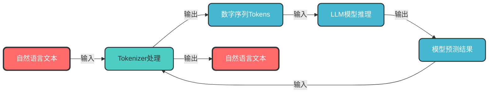
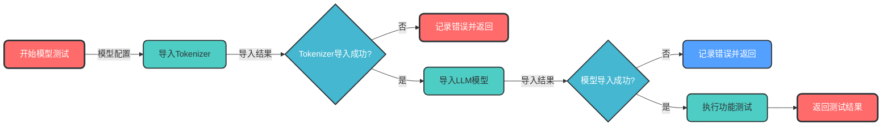
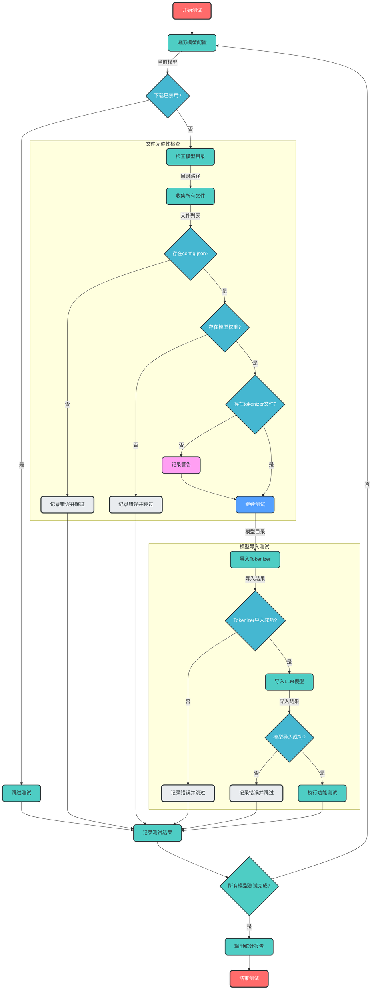

# Tokenizer与LLM模型关系深度解析

## 1. Tokenizer概述

### 1.1 什么是Tokenizer？

**Tokenizer（分词器）**是大语言模型（LLM）的核心组件，负责连接自然语言与模型内部表示：



### 1.2 Tokenizer核心功能

| 功能 | 说明 | 示例 |
|------|------|------|
| **文本编码** | 将自然语言转换为数字序列 | `"你好"` → `[101, 1966, 2510, 102]` |
| **文本解码** | 将数字序列转换为自然语言 | `[101, 1966, 2510, 102]` → `"你好"` |
| **词汇表管理** | 维护模型可识别的词汇集合 | 包含常见字、词、子词等 |
| **特殊标记处理** | 处理分隔符、掩码等特殊标记 | `[CLS]`、`[SEP]`、`[MASK]`等 |
| **文本预处理** | 处理换行、空格、大小写等 | 统一文本格式 |

## 2. Tokenizer与LLM模型导入顺序

### 2.1 为什么先导入Tokenizer？

在`test_model_import`函数中，采用先导入Tokenizer再导入模型的顺序，主要基于以下设计原则：



### 2.2 导入顺序的优势

| 优势 | 详细说明 |
|------|---------|
| **组件职责分离** | Tokenizer作为输入接口，模型作为计算引擎，独立验证确保每个组件正常工作 |
| **测试效率提升** | Tokenizer体积小、导入快，可提前发现问题，避免长时间等待模型导入 |
| **依赖关系验证** | Tokenizer导入成功验证了模型文件结构完整、词汇表可用，为模型导入奠定基础 |
| **故障快速定位** | 分层验证便于精确定位问题，是Tokenizer问题还是模型本身问题 |
| **符合使用逻辑** | 与实际使用流程一致，先初始化输入处理组件，再初始化计算组件 |

### 2.3 代码实现

在`test_model_import`函数中的导入逻辑：

```python
# 1. 先导入并验证Tokenizer（轻量快速）
tokenizer = AutoTokenizer.from_pretrained(
    model_config["local_dir"],
    trust_remote_code=True
)
logger.info(f"✓ 成功导入tokenizer: {model_config['name']}")

# 2. 再导入LLM模型（重量较慢）
model = AutoModel.from_pretrained(
    model_config["local_dir"],
    **model_kwargs
)
logger.info(f"✓ 成功导入LLM模型: {model_config['name']}")
```

## 3. Tokenizer文件的必要性

### 3.1 不同模型类型的Tokenizer需求

| 模型类型 | Tokenizer需求 | 原因 | 示例 |
|---------|-------------|------|------|
| **文本处理模型** | ✅ 必须 | 需要将文本转换为模型可理解的数字序列 | LLM、嵌入模型、重排序模型 |
| **图像处理模型** | ❌ 不需要 | 直接处理像素数据，不依赖文本 | CNN、Vision Transformer |
| **音频处理模型** | ❌ 不需要 | 直接处理音频波形或频谱数据 | Whisper、WaveNet |

### 3.2 代码中的Tokenizer文件检查

`check_model_exists`函数中的检查逻辑：

```python
# 支持的tokenizer文件类型
tokenizer_files = [
    "tokenizer.json",        # 完整配置文件
    "tokenizer_config.json",  # 基本配置文件
    "vocab.txt",             # 词汇表文件
    "sentencepiece.bpe.model", # SentencePiece模型
    "tokenizer.model"         # BPE模型（如GLM系列）
]

# 检查是否至少存在一个tokenizer文件
has_tokenizer = any(tokenizer_file in all_files for tokenizer_file in tokenizer_files)
if not has_tokenizer:
    logger.warning(f"缺少tokenizer文件: {tokenizer_files} in {local_dir}")
    # 注意：此处仅警告，不返回False，允许继续执行测试流程
```

### 3.3 分层验证策略

脚本采用"警告+严格验证"的分层策略：

```mermaid
flowchart LR
    %% 样式定义
    classDef startEnd fill:#FF6B6B,stroke:#2D3436,stroke-width:3px,color:white,rx:8,ry:8;
    classDef process fill:#4ECDC4,stroke:#2D3436,stroke-width:2px,color:#2D3436,rx:8,ry:8;
    classDef decision fill:#45B7D1,stroke:#2D3436,stroke-width:2px,color:white,rx:8,ry:8;
    classDef warning fill:#FF9FF3,stroke:#2D3436,stroke-width:2px,color:#2D3436,rx:8,ry:8;
    classDef error fill:#E9ECEF,stroke:#2D3436,stroke-width:3px,color:#2D3436,rx:8,ry:8;
    
    A[开始模型检查] -->|模型目录| B[检查模型文件完整性]
    B -->|文件列表| C{存在Tokenizer文件?}
    C -->|否| D[记录警告]
    C -->|是| E[继续执行]
    D --> E
    E -->|模型配置| F[测试模型导入]
    F -->|导入结果| G{Tokenizer导入成功?}
    G -->|否| H[记录错误并返回]
    G -->|是| I[模型导入]
    I -->|导入结果| J{模型导入成功?}
    J -->|否| K[记录错误并返回]
    J -->|是| L[功能测试]
    L --> M[返回测试结果]
    
    class A,M startEnd;
    class B,E,F,I,L process;
    class C,G,J decision;
    class D warning;
    class H,K error;
```



## 4. Tokenizer文件类型详解

### 4.1 常见Tokenizer文件类型

| 文件类型 | 格式 | 用途 | 常见模型 |
|---------|------|------|---------|
| `tokenizer.json` | JSON | 完整的tokenizer配置，包含所有参数和词汇表 | BERT、GPT系列 |
| `tokenizer_config.json` | JSON | 基本配置文件，不包含完整词汇表 | 大多数Hugging Face模型 |
| `vocab.txt` | 文本 | 简单词汇表，每行一个词 | BERT系列 |
| `sentencepiece.bpe.model` | 二进制 | SentencePiece模型，用于子词分割 | T5、LLaMA系列 |
| `tokenizer.model` | 二进制 | 字节对编码（BPE）模型，GLM系列专用 | chatglm3-6b、chatglm4-9b |

### 4.2 模型与Tokenizer文件对应关系

脚本中配置的5个模型及其Tokenizer需求：

| 模型名称 | 模型类型 | 必需的Tokenizer文件 |
|---------|---------|-------------------|
| `bge-large-zh-v1.5` | 嵌入模型 | `tokenizer.json` 或 `tokenizer_config.json` |
| `chatglm3-6b` | LLM | `tokenizer.model`（GLM系列专用） |
| `bge-reranker-large` | 重排序模型 | `tokenizer.json` 或相关配置文件 |
| `m3e-base` | 嵌入模型 | `tokenizer.json` 或 `tokenizer_config.json` |
| `chatglm4-9b-chat` | LLM | `tokenizer.model`（GLM系列专用） |

## 5. 实际使用流程

### 5.1 LLM完整使用流程


### 5.2 代码示例：完整推理流程

```python
# 1. 初始化Tokenizer
tokenizer = AutoTokenizer.from_pretrained("model_path", trust_remote_code=True)

# 2. 初始化模型
model = AutoModel.from_pretrained("model_path", trust_remote_code=True, device_map="auto")

# 3. 输入文本
input_text = "你好，这是一个测试"

# 4. 文本编码
inputs = tokenizer(input_text, return_tensors="pt")

# 5. 模型推理
outputs = model.generate(**inputs, max_new_tokens=50)

# 6. 结果解码
generated_text = tokenizer.decode(outputs[0], skip_special_tokens=True)

print(f"生成结果: {generated_text}")
```

## 6. 故障排查与常见问题

### 6.1 Tokenizer导入失败的常见原因

| 错误类型 | 可能原因 | 解决方案 |
|---------|---------|---------|
| **文件缺失** | 缺少tokenizer相关文件 | 检查模型目录，确保包含至少一个tokenizer文件 |
| **格式错误** | tokenizer文件损坏或格式不正确 | 重新下载模型文件，确保完整性 |
| **版本不兼容** | tokenizer与transformers库版本不兼容 | 更新transformers库或使用兼容版本 |
| **配置错误** | trust_remote_code参数设置不当 | 对于自定义模型，设置trust_remote_code=True |

### 6.2 日志解读

| 日志信息 | 含义 | 后续处理 |
|---------|------|---------|
| `✓ 成功导入tokenizer` | Tokenizer导入成功，模型文件结构完整 | 继续执行模型导入和功能测试 |
| `缺少tokenizer文件` | 模型目录中缺少tokenizer相关文件 | 检查模型文件，可能需要重新下载 |
| `导入模型失败` | Tokenizer或模型导入失败 | 查看详细错误信息，定位具体问题 |

## 7. 最佳实践与优化建议

### 7.1 模型文件管理

- **完整性检查**：下载模型后使用脚本检查文件完整性，确保包含所有必需文件
- **版本控制**：记录模型版本和对应的transformers库版本，避免版本冲突
- **备份策略**：定期备份重要模型文件，特别是自定义模型

### 7.2 测试流程优化

- **分层测试**：采用"文件检查→Tokenizer导入→模型导入→功能测试"的分层验证策略
- **日志详细化**：添加详细日志，便于问题定位和排查
- **自动化测试**：将模型测试集成到CI/CD流程，确保模型质量

### 7.3 性能优化

- **使用accelerate**：安装accelerate库并使用device_map="auto"优化模型加载
- **量化加载**：对于大型模型，考虑使用8bit或4bit量化，减少内存占用
- **缓存机制**：利用transformers的缓存机制，加速重复模型加载

## 8. 总结

### 8.1 核心结论

1. **Tokenizer是文本模型的必需组件**：所有文本处理模型都依赖Tokenizer连接自然语言与模型内部表示
2. **先导入Tokenizer是最佳实践**：提升测试效率、便于故障定位、符合使用逻辑
3. **分层验证确保可靠性**：文件检查阶段警告+导入阶段严格验证，平衡效率与可靠性
4. **不同模型需要不同Tokenizer文件**：了解模型特性，确保提供正确的Tokenizer文件

### 8.2 关键流程图

完整的模型测试流程：



通过本文的系统化整理，我们深入理解了Tokenizer与LLM模型的关系、导入顺序的原因以及Tokenizer文件的必要性。遵循最佳实践，采用分层验证策略，可确保模型的可靠性和测试效率。