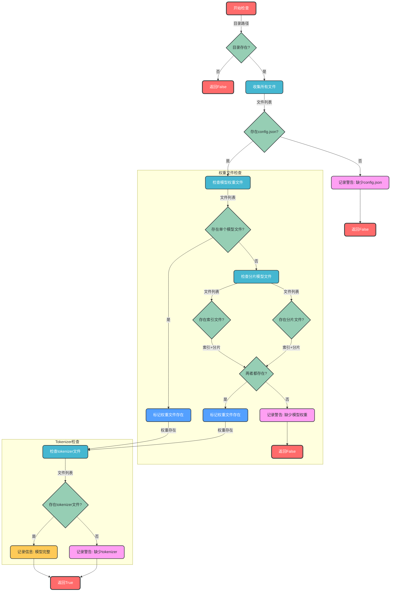
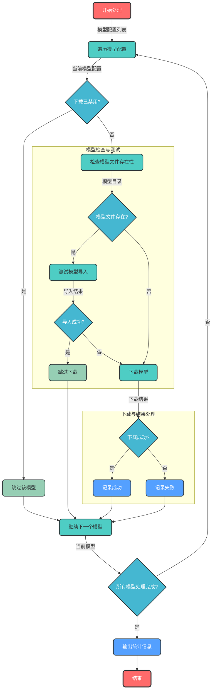
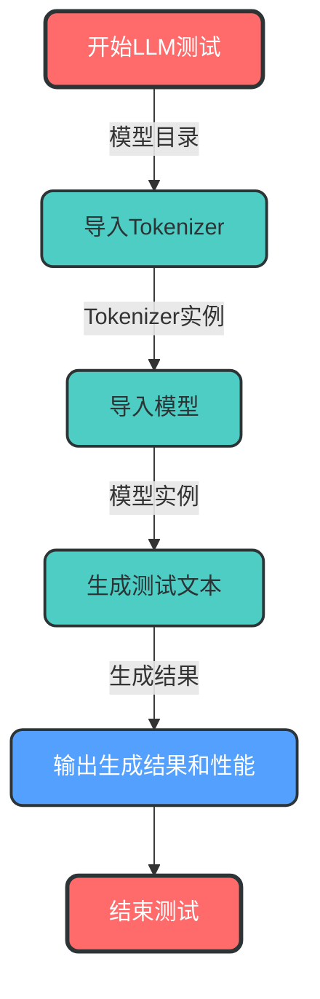
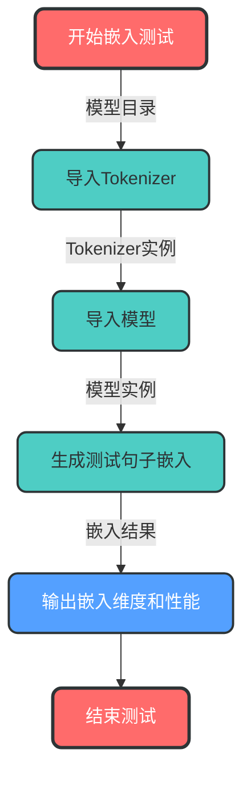
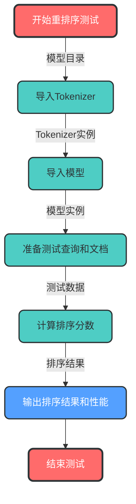

# 模型下载与验证脚本文档

| fufan-chat-api-6.0.0\model_download_scripts\download_all_models.py | 模型下载与验证脚本 |
|-------------------------------------------------------------------------------------------------|------------------|

## 1. 代码结构分析

### 1.1 核心功能概述

该脚本用于自动化下载、验证和测试多种AI模型，支持大型语言模型(LLM)、嵌入模型(Embedding)和重排序模型(Reranker)。主要功能包括：

- 模型文件完整性检查
- 模型下载管理
- 模型导入与功能测试
- 详细的日志输出

### 1.2 代码结构

```
├── 模型配置列表 (MODELS_CONFIG)
├── 核心函数
│   ├── check_model_exists() - 模型文件完整性检查
│   ├── test_model_import() - 模型导入与功能测试
│   ├── download_model() - 模型下载
│   └── main() - 主流程控制
└── 命令行参数处理
```

## 2. 模型完整性检查流程

### 2.1 检查逻辑

`check_model_exists`函数负责验证模型文件的完整性，采用以下检查逻辑：



### 2.2 检查项详情

| 检查类型 | 必选 | 检查内容 |
|---------|------|---------|
| 基础配置 | ✅ | config.json 文件 |
| 模型权重 | ✅ | 单个文件: model.safetensors 或 pytorch_model.bin<br>分片文件: pytorch_model.bin.index.json + pytorch_model-*-of-*.bin |
| Tokenizer | ⚠️ | 至少一个: tokenizer.json, tokenizer_config.json, vocab.txt, sentencepiece.bpe.model, tokenizer.model |

### 2.3 分片模型支持

脚本特别支持分片存储的模型（如chatglm3-6b），采用以下检查逻辑：

1. **索引文件检查**: 验证是否存在 `pytorch_model.bin.index.json`
2. **分片文件检查**: 验证是否存在命名格式为 `pytorch_model-*-of-*.bin` 的文件
3. **完整性验证**: 同时存在索引文件和分片文件时，认为模型权重完整

## 3. 模型下载与测试流程

### 3.1 主流程



### 3.2 模型测试流程

根据模型类型，测试流程分为三种：

#### LLM模型测试


#### 嵌入模型测试


#### 重排序模型测试


## 4. 模型配置说明

### 4.1 配置结构

```python
MODELS_CONFIG = [
    {
        "name": "模型名称",
        "model_id": "ModelScope模型ID",
        "local_dir": "本地存储路径",
        "revision": "模型版本",
        "is_llm/is_embedding/is_reranker": True,
        "need_download": True/False
    }
]
```

### 4.2 支持的模型类型

| 模型类型 | 标记 | 示例模型 |
|---------|------|---------|
| 大型语言模型 | is_llm: True | chatglm3-6b, chatglm4-9b-chat |
| 嵌入模型 | is_embedding: True | bge-large-zh-v1.5, m3e-base |
| 重排序模型 | is_reranker: True | bge-reranker-large |

## 5. 使用指南

### 5.1 运行方式

#### 使用虚拟环境运行
```bash
cd /e/github_project/fufan-chat-api-6.0.0
.venv/Scripts/python.exe model_download_scripts/download_all_models.py
```

#### 直接运行
```bash
python model_download_scripts/download_all_models.py
```

### 5.2 命令行参数

| 参数 | 类型 | 可选值 | 默认值 | 说明 |
|------|------|--------|--------|------|
| --verify-level | str | basic, full | full | 验证级别：basic(仅测试导入), full(测试导入和功能) |

### 5.3 日志输出

脚本采用详细的日志输出，包括：

- 处理进度和模型状态
- 下载成功/失败信息
- 模型完整性检查结果
- 模型导入和功能测试结果
- 性能指标（生成时间、嵌入时间等）

## 6. 代码优化建议

### 6.1 现有功能增强

1. **扩展分片模型支持**：
   - 支持更多分片格式，如 `model-*-of-*.safetensors`
   - 添加分片数量验证，确保所有分片都存在

2. **增强tokenizer检查**：
   - 根据模型类型智能检查所需的tokenizer文件
   - 支持更多tokenizer格式

3. **优化下载逻辑**：
   - 添加断点续传支持
   - 支持多线程下载

### 6.2 新增功能建议

1. **模型版本管理**：
   - 支持模型版本检查和更新
   - 记录模型下载时间和版本信息

2. **磁盘空间检查**：
   - 下载前检查磁盘空间是否足够
   - 支持自动清理旧模型

3. **多平台支持**：
   - 支持从Hugging Face等多个平台下载
   - 自动切换下载源

## 7. 常见问题与解决方案

| 问题 | 可能原因 | 解决方案 |
|------|---------|---------|
| 模型下载失败 | ModelScope平台404错误 | 1. 检查模型ID是否正确<br>2. 确认模型是否已发布<br>3. 从其他平台手动下载<br>4. 将need_download设为False |
| 模型导入失败 | 缺少依赖库 | 安装缺少的依赖，如：`pip install accelerate` |
| 功能测试失败 | 环境或参数问题 | 功能测试失败不影响模型使用，可继续使用 |
| 分片模型检查失败 | 缺少索引文件或分片文件 | 确保完整下载所有分片文件和索引文件 |

## 8. 性能优化

### 8.1 模型加载优化

脚本会自动检查并使用`accelerate`库进行优化：

- 当`accelerate`可用时，使用`device_map="auto"`优化大模型加载
- 自动检测GPU内存并分配模型权重
- 支持模型分片加载，减少内存占用

### 8.2 测试性能指标

脚本会输出详细的性能指标，包括：

- **LLM生成时间**：生成20个新token所需时间
- **嵌入生成时间**：生成单个句子嵌入所需时间
- **重排序时间**：处理多个文档排序所需时间

## 9. 扩展与定制

### 9.1 添加新模型

要添加新模型，只需在`MODELS_CONFIG`中添加新的配置项：

```python
{
    "name": "新模型名称",
    "model_id": "模型平台ID",
    "local_dir": "本地存储路径",
    "revision": "模型版本",
    "is_llm/is_embedding/is_reranker": True,
    "need_download": True
}
```

### 9.2 自定义检查项

可以通过修改`check_model_exists`函数来添加自定义检查项：

```python
# 示例：添加自定义文件检查
def check_model_exists(local_dir):
    # 现有检查逻辑...
    
    # 自定义检查
    custom_files = ["custom_config.json"]
    has_custom_files = any(file in all_files for file in custom_files)
    if not has_custom_files:
        logger.warning(f"缺少自定义文件: {custom_files} in {local_dir}")
    
    # 现有检查逻辑...
```

## 10. 总结

该模型下载与验证脚本提供了完整的模型管理功能，包括：

- ✅ **自动化下载**：支持从ModelScope平台自动下载模型
- ✅ **完整性验证**：全面检查模型文件，支持分片模型
- ✅ **功能测试**：自动测试模型导入和基本功能
- ✅ **详细日志**：提供清晰的操作日志和错误信息
- ✅ **灵活配置**：支持多种模型类型和自定义配置

脚本设计清晰，易于扩展和定制，适合作为AI模型管理的基础工具。