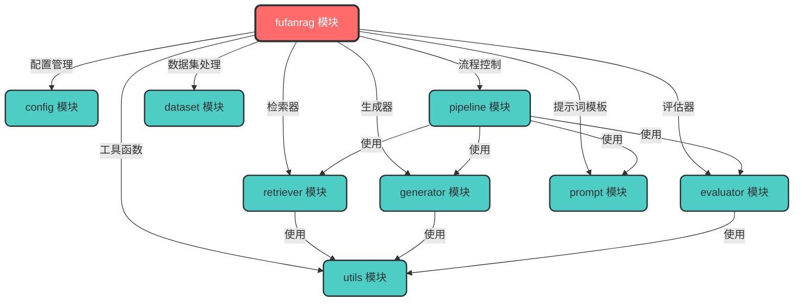
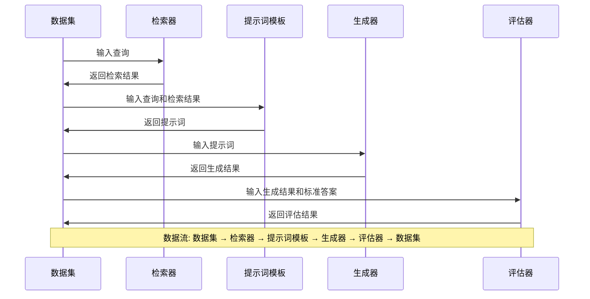
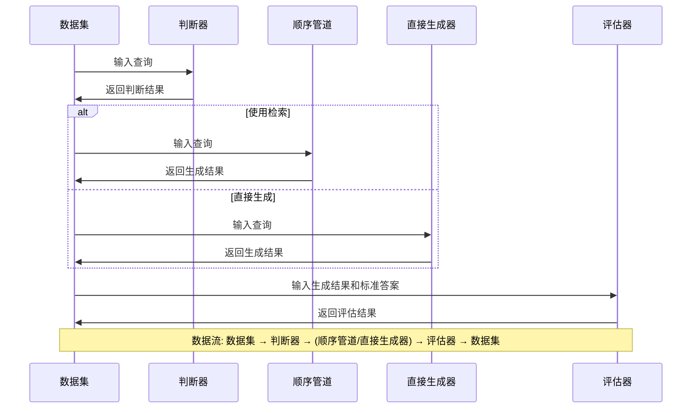
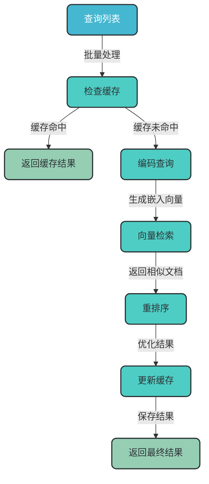
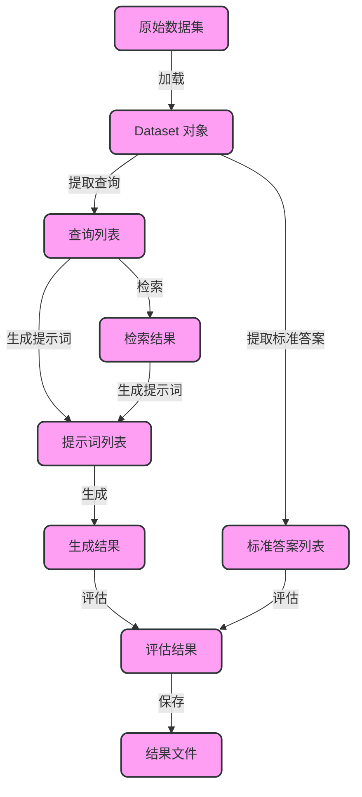

# fufanrag 模块架构分析

## 1. 概述

fufanrag 是一个基于 RAG (Retrieval-Augmented Generation) 的问答系统，用于实现基于检索增强的生成功能。该模块采用模块化设计，支持多种检索方式、生成模型和评估指标，具有良好的扩展性和灵活性。

## 2. 核心模块分析

### 2.1 架构图



### 2.2 模块说明

| 模块 | 主要职责 | 文件位置 |
|------|----------|----------|
| **config** | 配置管理，加载和合并配置文件 | `fufanrag/config/config.py` |
| **pipeline** | 核心流程控制，实现不同的 RAG 流程 | `fufanrag/pipeline/pipeline.py` |
| **retriever** | 检索器，支持多种检索方式 | `fufanrag/retriever/retriever.py` |
| **generator** | 生成器，支持多种生成模型 | `fufanrag/generator/generator.py` |
| **evaluator** | 评估器，评估生成结果 | `fufanrag/evaluator/evaluator.py` |
| **prompt** | 提示词模板，生成提示词 | `fufanrag/prompt/prompt.py` |
| **dataset** | 数据集处理，加载和处理数据集 | `fufanrag/dataset/dataset.py` |
| **utils** | 工具函数，提供通用功能 | `fufanrag/utils/utils.py` |

## 3. 核心流程分析

### 3.1 SequentialPipeline 流程



### 3.2 ConditionalPipeline 流程



### 3.3 检索器工作流程



## 4. 关键组件分析

### 4.1 配置管理

#### 4.1.1 功能概述

配置管理模块负责加载和合并配置文件，支持从文件和字典加载配置，并提供统一的配置访问接口。

#### 4.1.2 核心类

| 类名 | 主要职责 | 文件位置 |
|------|----------|----------|
| **Config** | 配置管理类，负责加载和合并配置 | `fufanrag/config/config.py:7` |

#### 4.1.3 工作流程

```mermaid
flowchart TD
    subgraph "配置加载阶段"
    A["初始化 Config"]:::start -->|加载文件配置| B["_load_file_config"]:::process
    A -->|加载变量配置| C["variable_config"]:::process
    end
    
    subgraph "配置合并阶段"
    B -->|合并配置| D["_merge_external_config"]:::process
    C -->|合并配置| D
    D -->|加载内部配置| E["_get_internal_config"]:::process
    E -->|获取最终配置| F["_get_final_config"]:::process
    end
    
    subgraph "配置处理阶段"
    F -->|检查配置| G["_check_final_config"]:::process
    G -->|设置额外键| H["_set_additional_key"]:::process
    H -->|初始化设备| I["_init_device"]:::process
    I -->|设置随机种子| J["_set_seed"]:::process
    J -->|准备目录| K["_prepare_dir"]:::process
    end
    
    K -->|完成初始化| L["final_config"]:::end
    
    classDef start fill:#FF6B6B,stroke:#2D3436,stroke-width:3px,color:white,rx:8,ry:8;
    classDef process fill:#4ECDC4,stroke:#2D3436,stroke-width:2px,color:#2D3436,rx:8,ry:8;
    classDef end fill:#96CEB4,stroke:#2D3436,stroke-width:2px,color:#2D3436,rx:8,ry:8;
    
    Note over A,L: 数据流: 配置文件 → 变量配置 → 外部配置合并 → 内部配置加载 → 最终配置生成 → 配置检查 → 设备初始化 → 目录准备 → 配置完成
```

### 4.2 检索器

#### 4.2.1 功能概述

检索器模块负责从语料库中检索与查询相关的文档，支持多种检索方式，包括 BM25 和 Dense Retrieval，支持缓存和重排序。

#### 4.2.2 核心类

| 类名 | 主要职责 | 文件位置 |
|------|----------|----------|
| **BaseRetriever** | 检索器基类，定义了检索器的基本接口 | `fufanrag/retriever/retriever.py:101` |
| **BM25Retriever** | 基于 BM25 的检索器 | `fufanrag/retriever/retriever.py:166` |
| **DenseRetriever** | 基于密集向量的检索器 | `fufanrag/retriever/retriever.py:227` |

#### 4.2.3 关键特性

- **缓存机制**：通过 `cache_manager` 装饰器实现，缓存检索结果，提高检索效率
- **重排序**：通过 `rerank_manager` 装饰器实现，支持对检索结果进行重排序，提高检索准确性
- **批量处理**：支持批量检索，提高处理效率
- **多检索方式**：支持 BM25 和 Dense Retrieval 两种检索方式

### 4.3 生成器

#### 4.3.1 功能概述

生成器模块负责根据提示词生成回答，支持多种生成模型，包括 Encoder-Decoder 模型、VLLM 模型、Hugging Face 因果语言模型和 FastChat 模型。

#### 4.3.2 核心类

| 类名 | 主要职责 | 文件位置 |
|------|----------|----------|
| **BaseGenerator** | 生成器基类，定义了生成器的基本接口 | `fufanrag/generator/generator.py:12` |
| **EncoderDecoderGenerator** | 编码器-解码器模型生成器 | `fufanrag/generator/generator.py:38` |
| **VLLMGenerator** | 基于 VLLM 的生成器，支持分布式部署 | `fufanrag/generator/generator.py:130` |
| **HFCausalLMGenerator** | 基于 Hugging Face 因果语言模型的生成器 | `fufanrag/generator/generator.py:219` |
| **FastChatGenerator** | 基于 FastChat 的生成器 | `fufanrag/generator/generator.py:365` |

#### 4.3.3 关键特性

- **多种生成模型**：支持多种生成模型，包括 T5、BART、LLM 等
- **批量处理**：支持批量生成，提高处理效率
- **分布式部署**：支持 VLLM 分布式部署，提高生成速度
- **灵活配置**：支持多种生成参数配置

#### 4.3.4 生成器工作流程

```mermaid
flowchart TD
    subgraph "输入处理阶段"
    A["输入列表"]:::input -->|批量处理| B["编码输入"]:::process
    B -->|生成输入张量| C["输入张量"]:::process
    end
    
    subgraph "生成阶段"
    C -->|调用生成模型| D["生成模型"]:::model
    D -->|生成输出张量| E["输出张量"]:::process
    E -->|解码输出| F["生成结果"]:::output
    end
    
    subgraph "后处理阶段"
    F -->|清理特殊字符| G["清理结果"]:::process
    G -->|返回最终结果| H["最终生成结果"]:::output
    end
    
    classDef input fill:#45B7D1,stroke:#2D3436,stroke-width:2px,color:white,rx:8,ry:8;
    classDef process fill:#4ECDC4,stroke:#2D3436,stroke-width:2px,color:#2D3436,rx:8,ry:8;
    classDef model fill:#54A0FF,stroke:#2D3436,stroke-width:2px,color:white,rx:8,ry:8;
    classDef output fill:#96CEB4,stroke:#2D3436,stroke-width:2px,color:#2D3436,rx:8,ry:8;
    
    Note over A,H: 数据流: 输入文本 → 编码 → 生成 → 解码 → 清理 → 最终结果
```

### 4.4 管道

#### 4.4.1 功能概述

管道模块负责控制 RAG 系统的整体流程，支持多种管道类型，包括顺序管道和条件管道。

#### 4.4.2 核心类

| 类名 | 主要职责 | 文件位置 |
|------|----------|----------|
| **BasicPipeline** | 管道基类，定义了管道的基本接口 | `fufanrag/pipeline/pipeline.py:7` |
| **SequentialPipeline** | 顺序管道，实现 query -> retriever -> generator -> evaluator 流程 | `fufanrag/pipeline/pipeline.py:66` |
| **ConditionalPipeline** | 条件管道，根据判断结果决定是否使用检索 | `fufanrag/pipeline/pipeline.py:116` |

#### 4.4.3 关键特性

- **多种管道类型**：支持顺序管道和条件管道
- **灵活扩展**：易于扩展新的管道类型
- **统一评估接口**：提供统一的评估接口
- **支持缓存**：支持检索结果缓存

## 5. 数据流程

### 5.1 数据流向图



### 5.2 数据格式

#### 5.2.1 数据集格式

```json
{
  "question": "问题文本",
  "golden_answers": ["标准答案1", "标准答案2"],
  "retrieval_result": [
    {"title": "文档标题1", "text": "文档内容1"},
    {"title": "文档标题2", "text": "文档内容2"}
  ],
  "prompt": "生成的提示词",
  "pred": "生成的回答"
}
```

#### 5.2.2 检索结果格式

```json
[
  {
    "title": "文档标题",
    "text": "文档内容",
    "score": 0.95
  },
  {
    "title": "文档标题2",
    "text": "文档内容2",
    "score": 0.85
  }
]
```

## 6. 配置说明

### 6.1 核心配置项

| 配置项 | 说明 | 默认值 |
|--------|------|--------|
| **dataset_path** | 数据集路径 | - |
| **index_path** | 索引路径 | - |
| **corpus_path** | 语料库路径 | - |
| **retrieval_method** | 检索方法 | - |
| **retrieval_topk** | 检索返回的文档数量 | 3 |
| **generator_model** | 生成模型名称 | - |
| **generator_model_path** | 生成模型路径 | - |
| **save_dir** | 结果保存目录 | - |
| **device** | 设备类型 | "cuda" |
| **save_retrieval_cache** | 是否保存检索缓存 | False |
| **use_retrieval_cache** | 是否使用检索缓存 | False |
| **use_reranker** | 是否使用重排序 | False |

## 7. 代码示例

### 7.1 基本使用示例

```python
from fufanrag.config import Config
from fufanrag.utils import get_dataset
from fufanrag.prompt import PromptTemplate
from fufanrag.pipeline import SequentialPipeline

# 配置
config = {
    'dataset_path': '/path/to/dataset',
    'index_path': '/path/to/index',
    'corpus_path': '/path/to/corpus',
    'retrieval_model_path': '/path/to/retrieval/model',
    'generator_model': 'chatglm3-6b',
    'generator_model_path': '/path/to/generator/model',
    'save_dir': '/path/to/save',
    'retrieval_method': 'bge-large-zh-v1',
    'retrieval_topk': 3,
    'device': 'cuda'
}

# 读取数据集
all_split = get_dataset(config)
test_data = all_split['test']

# 创建提示词模板
prompt_template = PromptTemplate(
    config,
    system_prompt="根据给定文档回答问题。只给出答案，不要输出其他任何词语。\n下面是给定的文档。\n\n{reference}",
    user_prompt="问题: {question}\n答案："
)

# 创建并运行管道
pipeline = SequentialPipeline(config, prompt_template=prompt_template)
output_dataset = pipeline.run(test_data, do_eval=True)

# 打印结果
for response in output_dataset.pred:
    print(response)
```

## 8. 总结

### 8.1 优势

1. **模块化设计**：采用模块化设计，各组件职责明确，易于扩展和维护
2. **多种检索方式**：支持 BM25 和 Dense Retrieval 多种检索方式
3. **多种生成模型**：支持多种生成模型，包括 Encoder-Decoder 模型和 LLM
4. **灵活的管道设计**：支持顺序管道和条件管道，适应不同场景
5. **支持分布式部署**：支持 VLLM 分布式部署，提高生成速度
6. **缓存机制**：支持检索结果缓存，提高检索效率
7. **重排序支持**：支持检索结果重排序，提高检索准确性

### 8.2 应用场景

1. **知识库问答**：基于本地知识库的问答系统
2. **文档检索增强**：结合文档检索的生成任务
3. **多模态问答**：结合多种数据源的问答系统
4. **对话系统**：支持上下文的对话系统
5. **智能客服**：基于检索增强的智能客服系统

### 8.3 改进建议

1. **增加更多检索方式**：支持更多检索算法，如 ColBERT、ANCE 等
2. **优化缓存机制**：支持更高效的缓存策略，如分布式缓存
3. **增强评估模块**：支持更多评估指标和评估方式
4. **增加可视化**：增加结果可视化功能，便于分析和调试
5. **优化文档加载**：支持更多文档格式和更高效的文档加载

fufanrag 是一个功能丰富、设计灵活的 RAG 系统，支持多种检索方式、生成模型和管道类型，具有良好的扩展性和灵活性，适用于多种问答场景。