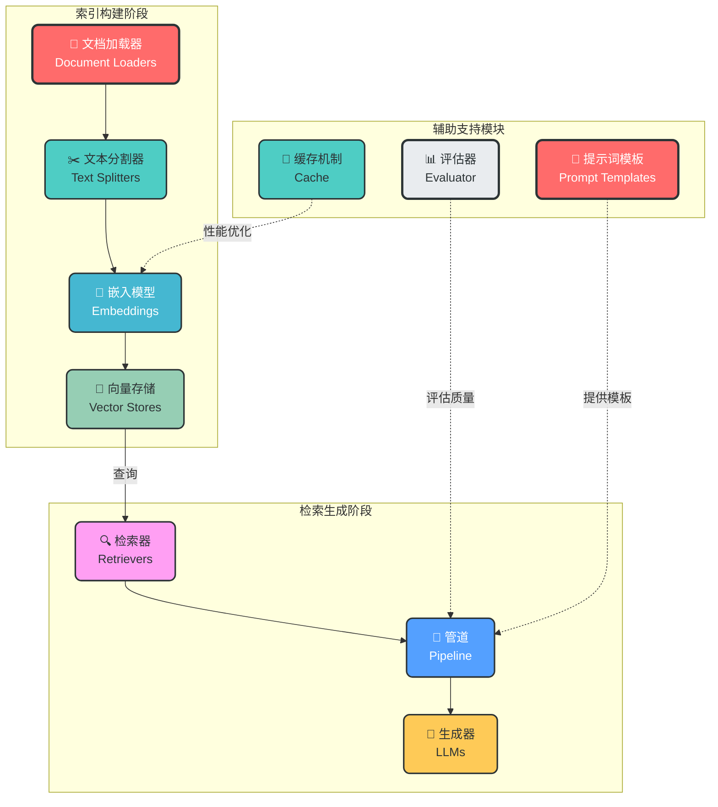
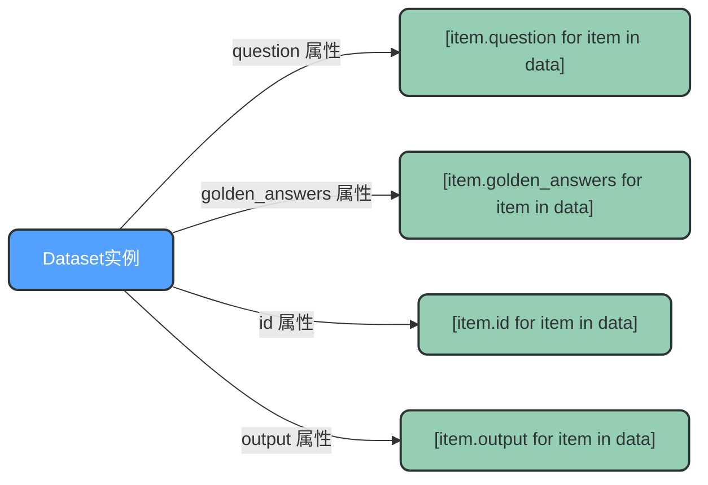
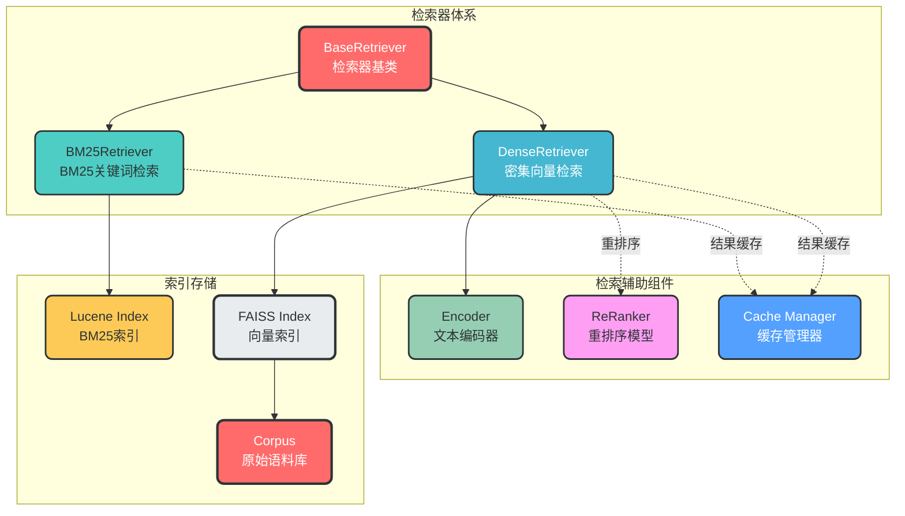
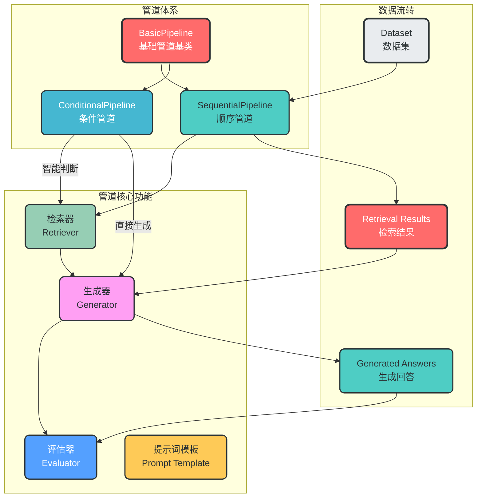
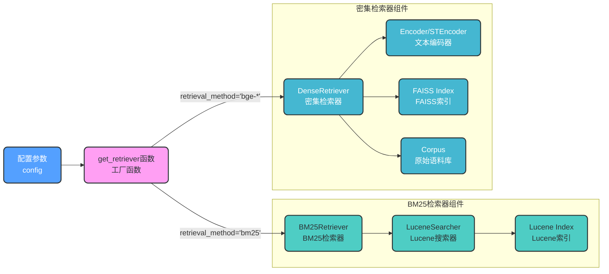
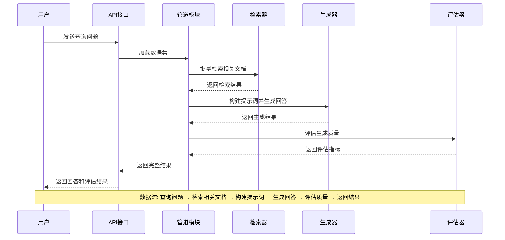
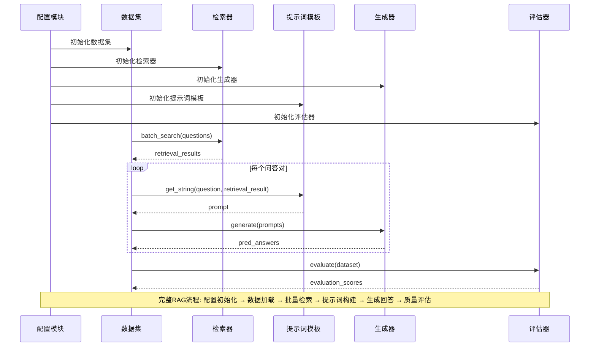

# fufanrag RAG框架模块化设计与管道流程分析

## 1. RAG框架核心模块概述

### 1.1 模块化设计理念

RAG（Retrieval-Augmented Generation，检索增强生成）框架采用模块化设计，将复杂的问答系统拆分为多个独立的功能模块。每个模块负责特定的任务，通过标准化接口进行数据传递和协作。这种设计模式的优势在于：

- **职责分离**：每个模块专注于单一功能，降低代码复杂度
- **灵活组合**：可以根据需求自由替换和组合不同模块
- **易于扩展**：新增功能只需添加新模块，不影响现有系统
- **便于测试**：每个模块可以独立测试和验证

### 1.2 核心模块分类

根据功能性质，RAG框架的模块可以分为三大类：

| 模块类别 | 包含模块 | 主要职责 |
|---------|---------|----------|
| **索引构建模块** | 文档加载器、文本分割器、嵌入模型、向量存储 | 将原始文档处理并存储为可检索的向量索引 |
| **检索生成模块** | 检索器、链/管道、生成器 | 根据用户查询检索相关文档并生成回答 |
| **辅助支持模块** | 评估器、提示词模板、缓存机制 | 评估生成质量、优化提示词、提高系统性能 |

### 1.3 fufanrag模块架构



## 2. fufanrag模块详细分析

### 2.1 fufanrag目录结构

```
fufanrag/
├── config/              # 配置管理模块
│   ├── __init__.py
│   └── config.py        # 配置加载和初始化
├── data/                # 数据存储目录
│   ├── indexes/         # 索引数据
│   ├── result/          # 评估结果
│   └── test/            # 测试数据
├── dataset/             # 数据集管理
│   ├── __init__.py
│   ├── dataset.py       # 数据集容器类
│   └── utils.py         # 数据集工具函数
├── evaluator/           # 评估模块
│   ├── __init__.py
│   ├── evaluator.py     # 评估器实现
│   ├── metrics.py       # 评估指标
│   └── utils.py         # 评估工具
├── generator/           # 生成器模块
│   ├── __init__.py
│   └── generator.py     # LLM生成器
├── pipeline/            # 管道模块（核心协调器）
│   ├── __init__.py
│   └── pipeline.py      # 管道实现
├── prompt/              # 提示词模板
│   ├── __init__.py
│   └── base_prompt.py   # 提示词模板基类
├── retriever/           # 检索器模块
│   ├── __init__.py
│   ├── encoder.py       # 文本编码器
│   ├── reranker.py      # 重排序模型
│   ├── retriever.py     # 检索器实现
│   └── utils.py         # 检索工具函数
└── utils/               # 通用工具
    ├── __init__.py
    └── utils.py         # 工具函数
```

### 2.2 数据集模块（Dataset）

数据集模块是RAG系统的数据载体，负责管理评估和测试用的问答数据。

#### 核心类设计

```python
# fufanrag/dataset/dataset.py

class Item:
    """
    单个数据样本容器，存储问答对及相关信息。
    """

    def __init__(self, item_dict):
        self.id = item_dict.get("id", None)
        self.question = item_dict.get("question", None)
        self.golden_answers = item_dict.get("golden_answers", [])
        self.metadata = item_dict.get("metadata", {})
        self.output = item_dict.get("output", {})


class Dataset:
    """
    数据集容器，管理所有数据样本。
    """

    def __init__(self, config=None, dataset_path=None, data=None):
        self.config = config
        self.dataset_name = config['dataset_name']
        self.dataset_path = dataset_path
        self.data = self._load_data(self.dataset_name, self.dataset_path)

    def _load_data(self, dataset_name, dataset_path):
        """从JSONL文件加载数据"""
        data = []
        with open(dataset_path, "r", encoding="utf-8") as f:
            for line in f:
                item_dict = json.loads(line)
                item = Item(item_dict)
                data.append(item)
        return data
```

#### 数据格式示例

```json
// fufanrag/data/test/test.jsonl
{"id": "1", "question": "什么是路由信息协议?", "golden_answers": ["路由信息协议（Routing Information Protocol，缩写：RIP）是一种内部网关协议（IGP）..."]}
{"id": "2", "question": "RIP协议和IGRP有什么不同?", "golden_answers": ["RIP协议和IGRP都是路由信息协议，但它们之间存在一些不同..."]}
```

#### 数据集属性访问



### 2.3 检索器模块（Retriever）

检索器模块是RAG系统的核心组件，负责从知识库中检索与用户查询相关的文档。

#### 检索器架构设计



#### BM25检索器实现

```python
# fufanrag/retriever/retriever.py

class BM25Retriever(BaseRetriever):
    """基于Lucene索引的BM25检索器"""

    def __init__(self, config):
        super().__init__(config)
        from pyserini.search.lucene import LuceneSearcher
        self.searcher = LuceneSearcher(self.index_path)
        self.contain_doc = self._check_contain_doc()
        if not self.contain_doc:
            self.corpus = load_corpus(self.corpus_path)

    def _search(self, query: str, num: int = None, return_score=False):
        if num is None:
            num = self.topk
        hits = self.searcher.search(query, num)
        scores = [hit.score for hit in hits]

        if self.contain_doc:
            all_contents = [json.loads(self.searcher.doc(hit.docid).raw())['contents']
                          for hit in hits]
            results = [{'title': content.split("\n")[0].strip("\""),
                       'text': "\n".join(content.split("\n")[1:]),
                       'contents': content} for content in all_contents]
        else:
            results = load_docs(self.corpus, [hit.docid for hit in hits])

        return (results, scores) if return_score else results
```

#### 密集向量检索器实现

```python
# fufanrag/retriever/retriever.py

class DenseRetriever(BaseRetriever):
    """基于FAISS向量索引的密集检索器"""

    def __init__(self, config: dict):
        super().__init__(config)
        self.index = faiss.read_index(self.index_path)
        self.corpus = load_corpus(self.corpus_path)

        if config['use_sentence_transformer']:
            self.encoder = STEncoder(
                model_name=self.retrieval_method,
                model_path=config['retrieval_model_path'],
                max_length=config['retrieval_query_max_length'],
                use_fp16=config['retrieval_use_fp16']
            )
        else:
            self.encoder = Encoder(
                model_name=self.retrieval_method,
                model_path=config['retrieval_model_path'],
                pooling_method=config['retrieval_pooling_method'],
                max_length=config['retrieval_query_max_length'],
                use_fp16=config['retrieval_use_fp16']
            )

    def _search(self, query: str, num: int = None, return_score=False):
        if num is None:
            num = self.topk

        query_emb = self.encoder.encode(query)
        scores, idxs = self.index.search(query_emb, k=num)
        results = load_docs(self.corpus, idxs[0])

        return (results, scores[0]) if return_score else results
```

#### 文本编码器实现

```python
# fufanrag/retriever/encoder.py

class Encoder:
    """文本编码器，将文本转换为向量"""

    def __init__(self, model_name, model_path, pooling_method, max_length, use_fp16):
        self.model_name = model_name
        self.model_path = model_path
        self.pooling_method = pooling_method
        self.max_length = max_length
        self.use_fp16 = use_fp16

        self.model, self.tokenizer = load_model(
            model_path=model_path,
            use_fp16=use_fp16
        )

    @torch.no_grad()
    def encode(self, query_list: List[str], is_query=True) -> np.ndarray:
        query_list = parse_query(self.model_name, query_list, is_query)

        inputs = self.tokenizer(query_list,
                                max_length=self.max_length,
                                padding=True,
                                truncation=True,
                                return_tensors="pt")
        inputs = {k: v.cuda() for k, v in inputs.items()}

        output = self.model(**inputs, return_dict=True)
        query_emb = pooling(output.pooler_output,
                           output.last_hidden_state,
                           inputs['attention_mask'],
                           self.pooling_method)

        query_emb = query_emb.detach().cpu().numpy()
        return query_emb.astype(np.float32, order="C")
```

### 2.4 管道模块（Pipeline）

管道模块是RAG系统的流程协调中心，负责将各个组件串联成完整的工作流。

#### 管道体系设计



#### 基础管道实现

```python
# fufanrag/pipeline/pipeline.py

class BasicPipeline:
    """
    管道基类，定义RAG流程的基本结构和接口。
    """

    def __init__(self, config, prompt_template=None):
        self.config = config
        self.device = config['device']
        self.retriever = None
        self.evaluator = Evaluator(config)
        self.save_retrieval_cache = config['save_retrieval_cache']

        if prompt_template is None:
            prompt_template = PromptTemplate(config)
        self.prompt_template = prompt_template

    def run(self, dataset):
        """执行RAG流程，子类需重写此方法"""
        pass

    def evaluate(self, dataset, do_eval=True, pred_process_fun=None):
        """评估生成结果"""
        if pred_process_fun is not None:
            raw_pred = dataset.pred
            processed_pred = [pred_process_fun(pred) for pred in raw_pred]
            dataset.update_output('raw_pred', raw_pred)
            dataset.update_output('pred', processed_pred)

        if do_eval:
            eval_result = self.evaluator.evaluate(dataset)
            print(eval_result)

        if self.save_retrieval_cache:
            self.retriever._save_cache()

        return dataset
```

#### 顺序管道实现

```python
# fufanrag/pipeline/pipeline.py

class SequentialPipeline(BasicPipeline):
    """
    顺序管道：标准RAG流程
    流程：查询 → 检索 → 重排序 → 生成 → 评估
    """

    def __init__(self, config, prompt_template=None):
        super().__init__(config, prompt_template)
        self.retriever = get_retriever(config)
        self.generator = get_generator(config)

    def run(self, dataset, do_eval=True, pred_process_fun=None):
        # 1. 获取查询
        input_query = dataset.question

        # 2. 执行检索
        retrieval_results = self.retriever.batch_search(input_query)
        dataset.update_output('retrieval_result', retrieval_results)

        # 3. 构建提示词
        input_prompts = [
            self.prompt_template.get_string(question=q, retrieval_result=r)
            for q, r in zip(dataset.question, dataset.retrieval_result)
        ]
        dataset.update_output('prompt', input_prompts)

        # 4. 生成回答
        pred_answer_list = self.generator.generate(input_prompts)
        dataset.update_output("pred", pred_answer_list)

        # 5. 评估结果
        dataset = self.evaluate(dataset, do_eval=do_eval, pred_process_fun=pred_process_fun)

        return dataset
```

### 2.5 检索器选择机制



```python
# fufanrag/utils/utils.py

def get_retriever(config):
    """根据配置自动选择检索器类"""
    if config['retrieval_method'] == "bm25":
        return getattr(
            importlib.import_module("fufanrag.retriever"),
            "BM25Retriever"
        )(config)
    else:
        return getattr(
            importlib.import_module("fufanrag.retriever"),
            "DenseRetriever"
        )(config)
```

## 3. RAG完整工作流程

### 3.1 整体数据流



### 3.2 索引构建流程

```mermaid
flowchart TB
    subgraph "索引构建阶段"
        A["📄 原始文档<br/>Raw Documents"]:::doc
        A -->|文档加载| B["📖 文档预处理<br/>Document Loader"]:::loader
        B -->|文本分割| C["✂️ 文本分块<br/>Text Chunking"]:::chunk
        C -->|嵌入编码| D["🔢 嵌入模型<br/>Embedding Model"]:::embed
        D -->|向量存储| E["💾 向量索引<br/>Vector Index"]:::index
        E -->|元数据存储| F["📋 语料库<br/>Corpus Metadata"]:::corpus
    end

    classDef doc fill:#FF6B6B,stroke:#2D3436,stroke-width:3px,color:white,rx:8,ry:8;
    classDef loader fill:#4ECDC4,stroke:#2D3436,stroke-width:2px,color:#2D3436,rx:8,ry:8;
    classDef chunk fill:#45B7D1,stroke:#2D3436,stroke-width:2px,color:white,rx:8,ry:8;
    classDef embed fill:#96CEB4,stroke:#2D3436,stroke-width:2px,color:#2D3436,rx:8,ry:8;
    classDef index fill:#FF9FF3,stroke:#2D3436,stroke-width:2px,color:#2D3436,rx:8,ry:8;
    classDef corpus fill:#54A0FF,stroke:#2D3436,stroke-width:2px,color:white,rx:8,ry:8;
```



### 3.3 查询处理流程

```mermaid
flowchart TB
    subgraph "查询处理阶段"
        A["❓ 用户查询<br/>User Query"]:::query
        A -->|查询编码| B["🔢 查询向量化<br/>Query Encoding"]:::encode
        B -->|相似度计算| C["📊 向量检索<br/>Vector Retrieval"]:::search
        C -->|结果重排序| D["🎯 结果重排序<br/>ReRanking"]:::rerank
        D -->|文档加载| E["📄 获取原始文档<br/>Load Documents"]:::load
        E -->|提示词构建| F["📝 提示词模板<br/>Prompt Template"]:::prompt
        F -->|回答生成| G["🤖 大模型生成<br/>LLM Generation"]:::generate
        G -->|质量评估| H["📈 结果评估<br/>Evaluation"]:::eval
    end

    classDef query fill:#FF6B6B,stroke:#2D3436,stroke-width:3px,color:white,rx:8,ry:8;
    classDef encode fill:#4ECDC4,stroke:#2D3436,stroke-width:2px,color:#2D3436,rx:8,ry:8;
    classDef search fill:#45B7D1,stroke:#2D3436,stroke-width:2px,color:white,rx:8,ry:8;
    classDef rerank fill:#96CEB4,stroke:#2D3436,stroke-width:2px,color:#2D3436,rx:8,ry:8;
    classDef load fill:#FF9FF3,stroke:#2D3436,stroke-width:2px,color:#2D3436,rx:8,ry:8;
    classDef prompt fill:#54A0FF,stroke:#2D3436,stroke-width:2px,color:white,rx:8,ry:8;
    classDef generate fill:#FECA57,stroke:#2D3436,stroke-width:2px,color:#2D3436,rx:8,ry:8;
    classDef eval fill:#E9ECEF,stroke:#2D3436,stroke-width:3px,color:#2D3436,rx:8,ry:8;
```



### 3.4 管道执行详细流程



## 4. 配置管理与使用示例

### 4.1 完整配置参数

```python
# fufanrag/pipeline/pipeline.py (示例配置)

config = {
    # 知识库路径配置
    'dataset_path': '/path/to/test/data',
    "index_path": "/path/to/faiss/index.faiss",
    "corpus_path": "/path/to/corpus.jsonl",
    "retrieval_model_path": "/path/to/encoder/model",
    "retrieval_cache_path": "/path/to/cache",

    # 生成模型配置
    "generator_model": "chatglm3-6b",
    "generator_model_path": "/path/to/llm/model",

    # 检索配置
    'dataset_name': "test",
    'retrieval_method': 'bge-large-zh-v1',
    "retrieval_topk": 3,
    "use_reranker": False,
    "retrieval_pooling_method": "mean",
    "retrieval_batch_size": 12,

    # 评估配置
    "save_metric_score": True,
    "save_intermediate_data": True,
    "metrics": ['em', 'sub_em', 'f1', 'precision', 'recall'],

    # 系统配置
    "device": "cuda",
    "framework": "fschat"
}
```

### 4.2 管道使用示例

```python
# fufanrag/pipeline/pipeline.py (使用示例)

from fufanrag.utils import get_dataset
from fufanrag.pipeline import SequentialPipeline
from fufanrag.prompt import PromptTemplate

# 1. 配置参数
config = {...}  # 如上所示

# 2. 加载数据集
all_split = get_dataset(config)
test_data = all_split['test']

# 3. 构建提示模板
prompt_template = PromptTemplate(
    config,
    system_prompt="根据给定文档回答问题。只给出答案，不要输出其他任何词语。\n下面是给定的文档。\n\n{reference}",
    user_prompt="问题: {question}\n答案："
)

# 4. 初始化管道
pipeline = SequentialPipeline(config, prompt_template=prompt_template)

# 5. 执行RAG流程
output_dataset = pipeline.run(test_data, do_eval=True)

# 6. 获取结果
for response in output_dataset.pred:
    print(response)
```

## 5. 与其他RAG框架的对比

### 5.1 框架对比概览

| 特性 | fufanrag | LangChain | LlamaIndex | Haystack |
|------|----------|-----------|------------|----------|
| **核心概念** | Pipeline | Chain | Query Engine | Pipeline |
| **模块划分** | 细粒度 | 中等粒度 | 粗粒度 | 细粒度 |
| **检索方式** | BM25 + Dense | 多种 | 多种 | 多种 |
| **评估模块** | 内置 | 需集成 | 需集成 | 需集成 |
| **适用场景** | 研究评估 | 通用开发 | 索引构建 | 企业部署 |
| **学习曲线** | 中等 | 较低 | 低 | 较高 |

### 5.2 管道设计模式对比


## 6. 总结与最佳实践

### 6.1 模块化设计的核心价值

fufanrag RAG框架通过模块化设计实现了以下核心价值：

1. **流程标准化**：定义了清晰的RAG流程接口，便于不同实现的集成
2. **组件可替换**：支持灵活替换检索器、生成器等核心组件
3. **评估内置化**：集成了完整的评估模块，便于系统性能评估
4. **配置驱动**：通过配置文件管理所有参数，提高系统的灵活性

### 6.2 最佳实践建议

| 场景 | 推荐配置 | 说明 |
|------|---------|------|
| **关键词查询** | retrieval_method='bm25' | 使用BM25检索，适合精确关键词匹配 |
| **语义查询** | retrieval_method='bge-large-zh-v1' | 使用密集向量检索，适合语义理解 |
| **高质量检索** | use_reranker=True | 启用重排序，提高检索精度 |
| **批量处理** | retrieval_batch_size=12 | 调整批量大小，优化处理效率 |

### 6.3 扩展方向

fufanrag框架可以进一步扩展以下功能：

- **混合检索**：同时使用BM25和密集检索，融合结果
- **多级检索**：实现多阶段检索，如粗排+精排
- **上下文管理**：支持对话历史的上下文管理
- **流式输出**：支持生成结果的流式返回

通过持续的模块化设计和优化，fufanrag可以成为一个功能完善、性能优异的RAG框架。
