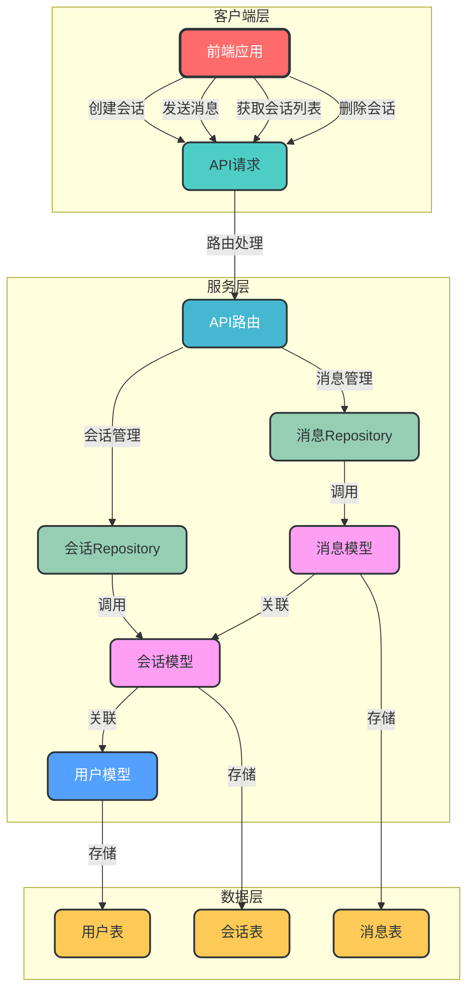
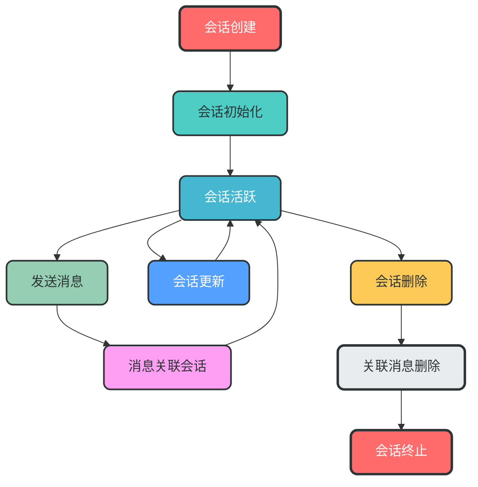
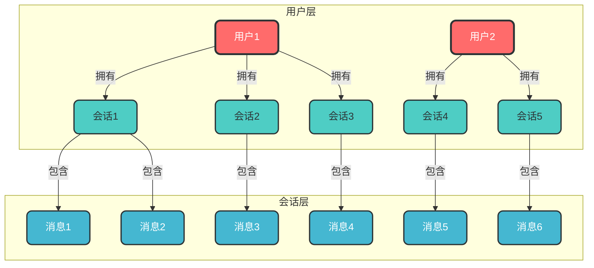
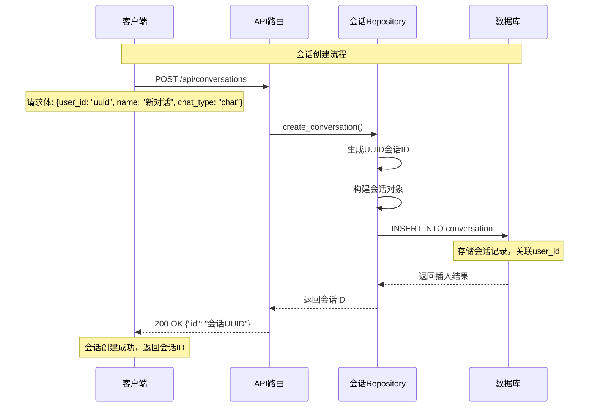
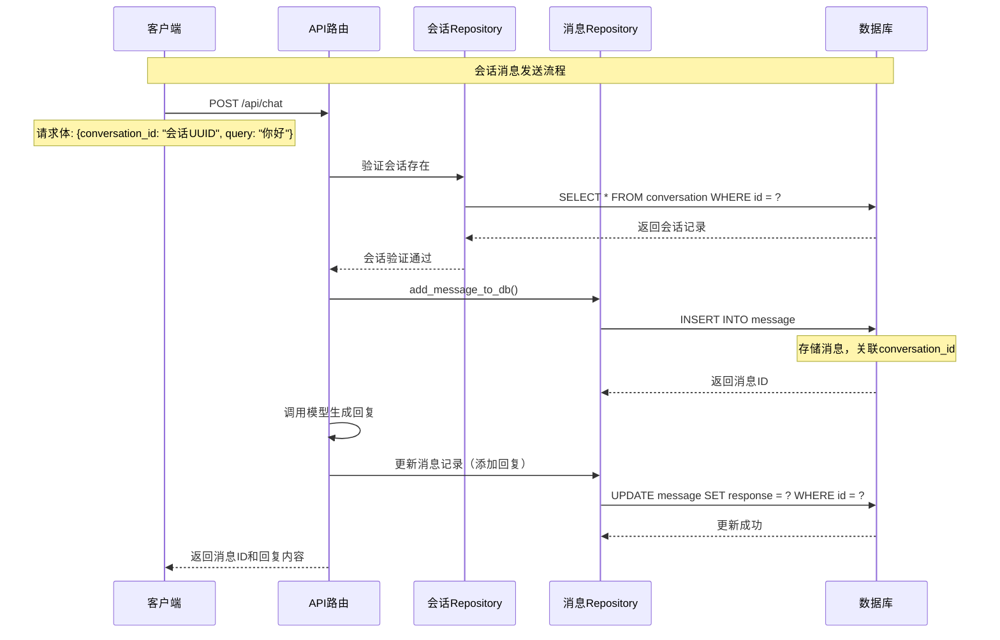
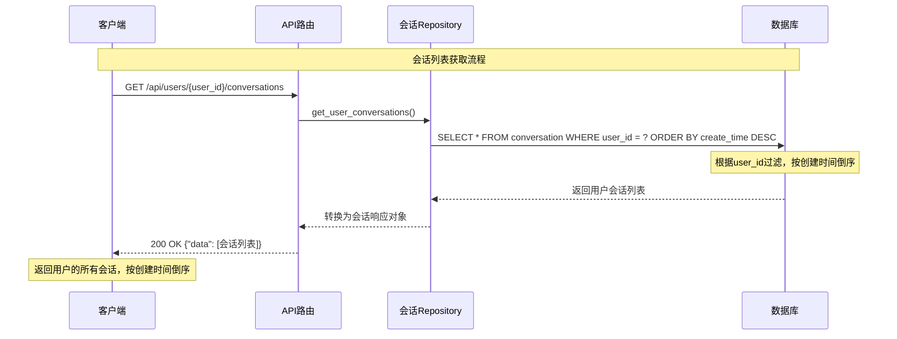
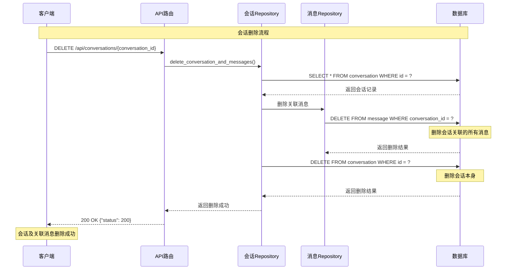

# 会话管理机制详解

## 1. 概述

会话管理是聊天系统的核心组件之一，负责管理用户的聊天会话、维护会话状态和关联会话消息。本项目采用基于数据库的持久化会话管理机制，支持多用户、多会话类型和完整的会话生命周期管理。

## 2. 核心组件架构

### 2.1 组件关系图



### 2.2 核心组件说明

| 组件 | 作用 | 实现文件 | 数据流向 |
|------|------|----------|----------|
| **会话模型** | 定义会话数据结构 | `server/db/models/conversation_model.py` | 服务层 ↔ 数据层 |
| **消息模型** | 定义消息数据结构 | `server/db/models/message_model.py` | 服务层 ↔ 数据层 |
| **用户模型** | 定义用户数据结构 | `server/db/models/user_model.py` | 服务层 ↔ 数据层 |
| **会话Repository** | 会话CRUD操作 | `server/db/repository/conversation_repository.py` | API层 ↔ 服务层 ↔ 数据层 |
| **消息Repository** | 消息CRUD操作 | `server/db/repository/message_repository.py` | API层 ↔ 服务层 ↔ 数据层 |
| **API路由** | 处理HTTP请求 | `server/api_router.py` | 客户端层 ↔ 服务层 |

## 3. 会话生命周期管理

### 3.1 会话生命周期流程图



### 3.2 会话状态转换

| 状态 | 描述 | 触发事件 | 后续状态 |
|------|------|----------|----------|
| **创建中** | 会话正在创建 | 客户端请求创建会话 | 活跃 |
| **活跃** | 会话正常使用中 | 发送消息、更新会话 | 活跃/删除 |
| **删除中** | 会话正在删除 | 客户端请求删除会话 | 已删除 |
| **已删除** | 会话已被删除 | 关联消息删除完成 | 终止 |
| **终止** | 会话生命周期结束 | 所有资源释放 | 无 |

## 4. 会话与用户关联机制

### 4.1 关联关系图



### 4.2 关联实现

```python
# 会话模型中的用户关联
class ConversationModel(Base):
    user_id = Column(CHAR(36), ForeignKey('user.id'), comment='用户ID')
    user = relationship('UserModel', back_populates='conversations')
    
# 用户模型中的会话关联
class UserModel(Base):
    conversations = relationship('ConversationModel', back_populates='user')
```

## 5. 会话创建流程

### 5.1 时序图



### 5.2 数据流向

1. **客户端请求**：包含 `user_id`、`name` 和 `chat_type`
2. **API路由**：接收请求，调用会话Repository
3. **会话Repository**：
   - 生成UUID会话ID
   - 构建会话对象
   - 设置关联的 `user_id`
4. **数据库**：存储会话记录，建立与用户的关联
5. **返回结果**：返回会话ID给客户端

## 6. 会话消息发送流程

### 6.1 时序图



### 6.2 关键步骤

1. **会话验证**：确保会话存在且属于当前用户
2. **消息存储**：先存储用户查询，生成消息ID
3. **模型调用**：调用大模型生成回复
4. **消息更新**：将模型回复更新到消息记录中
5. **结果返回**：返回完整的消息信息给客户端

## 7. 会话列表获取流程

### 7.1 时序图



### 7.2 过滤机制

```python
# 会话查询时的user_id过滤
result = await async_session.execute(
    select(ConversationModel)
    .where(ConversationModel.user_id == user_id,
           ConversationModel.chat_type == chat_types)
    .order_by(desc(ConversationModel.create_time))
)
```

## 8. 会话删除流程

### 8.1 时序图



### 8.2 事务处理

```python
# 会话删除的事务处理
async with session.begin():
    # 检查会话存在
    conversation = await session.get(ConversationModel, conversation_id)
    
    # 删除关联消息
    await session.execute(
        delete(MessageModel).where(MessageModel.conversation_id == conversation_id)
    )
    
    # 删除会话本身
    await session.delete(conversation)
    
    # 提交事务
    await session.commit()
```

## 9. 会话管理的关键特性

### 9.1 多会话类型支持

| 聊天类型 | 描述 | 应用场景 |
|----------|------|----------|
| **chat** | 普通聊天 | 通用对话 |
| **agent_chat** | Agent聊天 | 智能代理对话 |
| **knowledge_base_chat** | 知识库聊天 | 基于文档的问答 |
| **search_engine_chat** | 搜索引擎聊天 | 联网搜索问答 |
| **recommend_chat** | 推荐聊天 | 内容推荐 |

### 9.2 会话ID生成机制

- **生成方式**：UUID v4
- **格式**：36位字符串，如 `550e8400-e29b-41d4-a716-446655440000`
- **唯一性**：全局唯一，确保跨用户会话隔离
- **安全性**：随机生成，难以猜测和伪造

### 9.3 会话持久化

- **存储方式**：关系型数据库
- **表结构**：`conversation` 表存储会话信息
- **关联关系**：与用户表和消息表建立外键关联
- **查询优化**：支持按 `user_id`、`chat_type` 和 `create_time` 查询

## 10. 代码实现细节

### 10.1 会话Repository核心方法

```python
# 创建会话
async def create_conversation(request: CreateConversationRequest):
    new_conversation = ConversationModel(
        id=str(uuid.uuid4()),  # 生成UUID
        user_id=request.user_id,  # 关联用户
        name=request.name,
        chat_type=request.chat_type,
        create_time=datetime.now(),
    )
    session.add(new_conversation)
    await session.commit()
    
# 获取用户会话
async def get_user_conversations(user_id: str, chat_types: str):
    result = await async_session.execute(
        select(ConversationModel)
        .where(ConversationModel.user_id == user_id,  # 按user_id过滤
               ConversationModel.chat_type == chat_types)
        .order_by(desc(ConversationModel.create_time))
    )
    
# 删除会话
async def delete_conversation_and_messages(conversation_id: str):
    # 删除关联消息
    await session.execute(
        delete(MessageModel).where(MessageModel.conversation_id == conversation_id)
    )
    # 删除会话
    await session.delete(conversation)
```

### 10.2 会话模型定义

```python
class ConversationModel(Base):
    __tablename__ = 'conversation'
    id = Column(CHAR(36), primary_key=True, default=lambda: str(uuid.uuid4()))
    user_id = Column(CHAR(36), ForeignKey('user.id'), comment='用户ID')
    name = Column(String(50), comment='对话框名称')
    chat_type = Column(String(50), comment='聊天类型')
    create_time = Column(DateTime, default=func.now(), comment='创建时间')
    
    # 关系映射
    user = relationship('UserModel', back_populates='conversations')
    messages = relationship('MessageModel', back_populates='conversation')
```

## 11. 最佳实践与优化建议

### 11.1 性能优化

1. **添加索引**：
   ```python
   __table_args__ = (
       Index('idx_conversation_user_id', 'user_id'),
       Index('idx_conversation_chat_type', 'chat_type'),
       Index('idx_conversation_create_time', 'create_time'),
   )
   ```

2. **分页查询**：
   ```python
   # 添加分页支持
   async def get_user_conversations(user_id: str, page: int = 1, page_size: int = 20):
       offset = (page - 1) * page_size
       result = await async_session.execute(
           select(ConversationModel)
           .where(ConversationModel.user_id == user_id)
           .order_by(desc(ConversationModel.create_time))
           .offset(offset)
           .limit(page_size)
       )
   ```

### 11.2 安全性增强

1. **会话权限验证**：
   ```python
   # 验证会话属于当前用户
   async def verify_conversation_ownership(conversation_id: str, user_id: str):
       conversation = await session.get(ConversationModel, conversation_id)
       if not conversation or conversation.user_id != user_id:
           raise HTTPException(status_code=403, detail="无权限访问该会话")
   ```

2. **会话状态管理**：
   ```python
   # 添加会话状态字段
   class ConversationModel(Base):
       status = Column(String(20), default='active', comment='会话状态')
   ```

### 11.3 扩展性考虑

1. **会话模板支持**：
   ```python
   # 支持会话模板
   class ConversationTemplateModel(Base):
       id = Column(CHAR(36), primary_key=True)
       name = Column(String(50), comment='模板名称')
       chat_type = Column(String(50), comment='聊天类型')
       template = Column(JSON, comment='会话模板配置')
   ```

2. **会话标签系统**：
   ```python
   # 会话标签关联表
   class ConversationTagModel(Base):
       conversation_id = Column(CHAR(36), ForeignKey('conversation.id'), primary_key=True)
       tag_id = Column(CHAR(36), ForeignKey('tag.id'), primary_key=True)
   ```

## 12. 总结

### 12.1 会话管理机制特点

1. **基于数据库的持久化**：确保会话数据不丢失
2. **完整的生命周期管理**：从创建到删除的全流程支持
3. **多用户隔离**：通过 `user_id` 字段实现用户会话隔离
4. **多会话类型**：支持不同场景的聊天需求
5. **强类型关联**：通过外键建立会话与用户、消息的关联
6. **事务安全**：关键操作使用事务确保数据一致性

### 12.2 技术选型优势

1. **UUID会话ID**：全局唯一，避免冲突
2. **关系型数据库**：支持复杂查询和事务
3. **ORM框架**：简化数据库操作，提高开发效率
4. **RESTful API**：标准接口设计，易于集成
5. **模块化设计**：组件职责清晰，便于维护和扩展

### 12.3 未来发展方向

1. **会话缓存机制**：提高会话查询性能
2. **会话分析功能**：提供会话统计和分析
3. **会话共享功能**：支持多用户共享会话
4. **会话模板化**：提供会话模板管理
5. **会话迁移支持**：支持会话数据迁移和备份

## 13. 参考资料

1. [SQLAlchemy ORM文档](https://docs.sqlalchemy.org/en/20/orm/)
2. [UUID生成机制](https://uuidtools.com/)
3. [RESTful API设计最佳实践](https://restfulapi.net/)
4. [数据库事务管理](https://www.postgresql.org/docs/current/tutorial-transactions.html)
