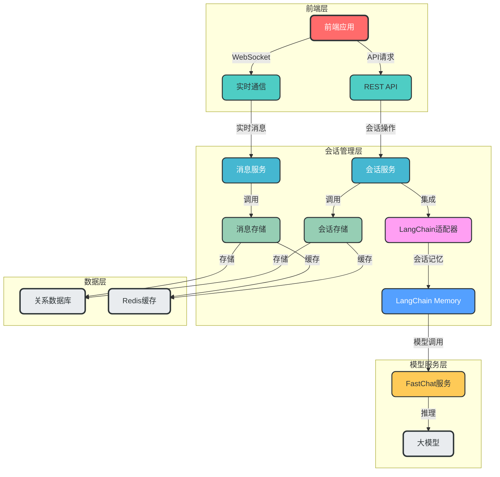
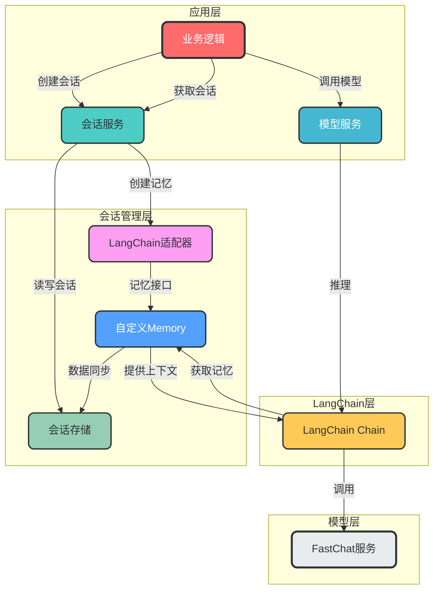
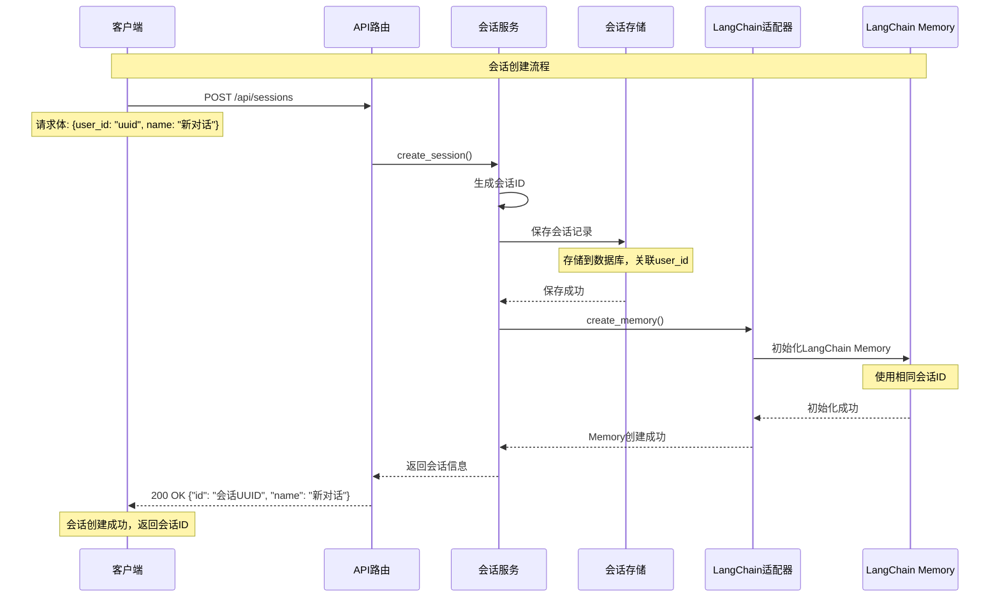
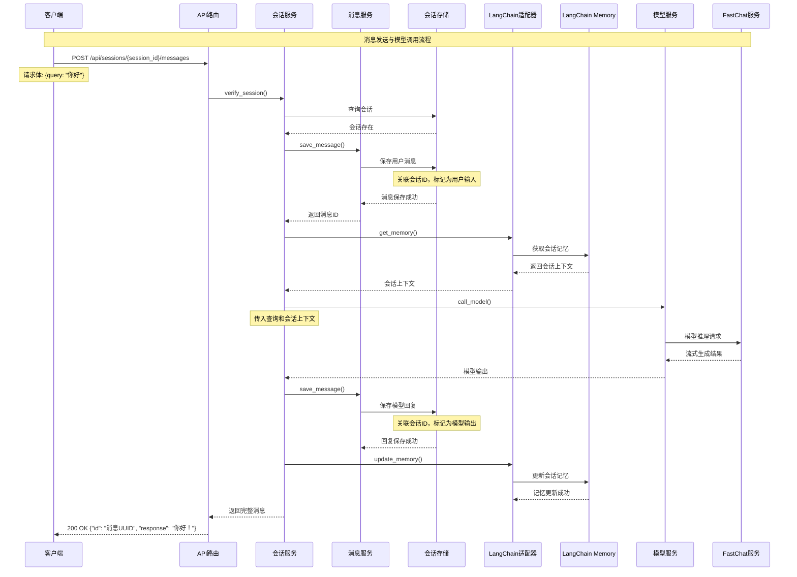

# 会话管理系统设计与集成方案

## 1. 概述

本方案旨在设计一个模块化、可扩展的会话管理系统，实现与现有项目的无缝集成，并解决与LangChain会话管理的潜在冲突。该系统将提供完整的会话生命周期管理、消息关联和历史记录管理功能。

## 2. 核心设计目标

| 目标 | 描述 |
|------|------|
| **模块化设计** | 会话管理与业务逻辑分离，便于维护和扩展 |
| **无缝集成** | 与现有项目的API和数据模型兼容 |
| **LangChain集成** | 与LangChain会话记忆协同工作，避免冲突 |
| **高性能** | 支持高并发场景，低延迟响应 |
| **可扩展** | 支持多种会话存储方式和消息格式 |

## 3. 架构设计

### 3.1 系统架构图



### 3.2 核心组件说明

| 组件 | 作用 | 数据流向 | 集成点 |
|------|------|----------|--------|
| **REST API** | 提供HTTP接口 | 前端 ↔ 会话服务 | `server/api_router.py` |
| **实时通信** | WebSocket支持 | 前端 ↔ 消息服务 | 新增WebSocket路由 |
| **会话服务** | 会话生命周期管理 | API ↔ 会话存储 | `server/repository/conversation_repository.py` |
| **消息服务** | 消息处理与推送 | WebSocket ↔ 消息存储 | `server/repository/message_repository.py` |
| **会话存储** | 会话数据持久化 | 会话服务 ↔ 数据库/缓存 | 现有数据库模型 |
| **消息存储** | 消息数据持久化 | 消息服务 ↔ 数据库/缓存 | 现有数据库模型 |
| **LangChain适配器** | 协调LangChain会话记忆 | 会话服务 ↔ LangChain Memory | `server/memory/` |
| **LangChain Memory** | 模型会话上下文 | LangChain适配器 ↔ FastChat | 现有LangChain集成 |

## 4. 会话管理与LangChain集成设计

### 4.1 集成架构图



### 4.2 集成模式

采用**适配器模式**解决与LangChain的集成问题：

1. **自定义Memory类**：继承LangChain的BaseChatMemory，实现与自定义会话存储的交互
2. **双向数据同步**：
   - 会话服务 → LangChain Memory：同步会话历史
   - LangChain Memory → 会话服务：保存新生成的消息
3. **统一会话ID**：使用相同的会话ID关联自定义会话和LangChain Memory

## 5. 会话流程设计

### 5.1 会话创建流程



### 5.2 消息发送与模型调用流程



## 6. 数据模型设计

### 6.1 核心数据模型

```python
# 会话模型（现有模型扩展）
class ConversationModel(Base):
    __tablename__ = 'conversation'
    id = Column(CHAR(36), primary_key=True)  # 会话ID
    user_id = Column(CHAR(36), ForeignKey('user.id'))  # 用户ID
    name = Column(String(50))  # 会话名称
    chat_type = Column(String(50))  # 聊天类型
    status = Column(String(20), default='active')  # 会话状态
    create_time = Column(DateTime, default=func.now())  # 创建时间
    update_time = Column(DateTime, default=func.now(), onupdate=func.now())  # 更新时间
    
    # 关系映射
    user = relationship('UserModel', back_populates='conversations')
    messages = relationship('MessageModel', back_populates='conversation')

# 消息模型（现有模型扩展）
class MessageModel(Base):
    __tablename__ = 'message'
    id = Column(CHAR(36), primary_key=True)  # 消息ID
    conversation_id = Column(CHAR(36), ForeignKey('conversation.id'))  # 会话ID
    role = Column(String(20))  # 角色：user/assistant/system
    content = Column(Text)  # 消息内容
    message_type = Column(String(20))  # 消息类型：text/image/audio
    meta_data = Column(JSON)  # 元数据
    create_time = Column(DateTime, default=func.now())  # 创建时间
    
    # 关系映射
    conversation = relationship('ConversationModel', back_populates='messages')
```

### 6.2 LangChain Memory适配器

```python
from langchain.memory import BaseChatMemory
from langchain.schema import BaseMessage, HumanMessage, AIMessage
from server.db.session import get_async_db
from server.db.repository.message_repository import filter_message

class CustomSessionMemory(BaseChatMemory):
    """自定义会话记忆，与项目会话管理集成"""
    
    def __init__(self, conversation_id: str, chat_type: str, message_limit: int = 10):
        super().__init__()
        self.conversation_id = conversation_id
        self.chat_type = chat_type
        self.message_limit = message_limit
        self.memory_key = "chat_history"
    
    @property
    def chat_memory(self):
        # 从数据库加载会话历史
        return self.load_chat_history()
    
    async def load_chat_history(self):
        """从数据库加载会话历史"""
        async with get_async_db() as session:
            messages = await filter_message(
                session=session,
                conversation_id=self.conversation_id,
                chat_type=self.chat_type,
                limit=self.message_limit
            )
        
        # 转换为LangChain消息格式
        chat_history = []
        for msg in messages:
            if msg.role == "user":
                chat_history.append(HumanMessage(content=msg.content))
            elif msg.role == "assistant":
                chat_history.append(AIMessage(content=msg.content))
        
        return chat_history
    
    async def save_context(self, inputs: dict, outputs: dict):
        """保存对话上下文"""
        # 调用现有的消息保存逻辑
        from server.db.repository.message_repository import add_message_to_db
        
        # 保存用户消息
        await add_message_to_db(
            query=inputs.get("input"),
            conversation_id=self.conversation_id,
            chat_type=self.chat_type,
            role="user"
        )
        
        # 保存模型回复
        await add_message_to_db(
            query=inputs.get("input"),
            conversation_id=self.conversation_id,
            chat_type=self.chat_type,
            response=outputs.get("text"),
            role="assistant"
        )
    
    def clear(self):
        """清空会话记忆"""
        # 调用现有会话删除逻辑
        pass
```

## 7. 系统集成方案

### 7.1 与现有项目的集成点

| 现有模块 | 集成方式 | 修改内容 |
|----------|----------|----------|
| **API路由** | 扩展现有路由 | 在 `server/api_router.py` 中添加会话相关路由 |
| **会话Repository** | 替换现有实现 | 重构 `conversation_repository.py` 为服务化设计 |
| **消息Repository** | 替换现有实现 | 重构 `message_repository.py` 为服务化设计 |
| **LangChain集成** | 替换Memory实现 | 使用自定义 `CustomSessionMemory` 替换现有Memory |
| **数据库模型** | 扩展现有模型 | 添加 `status` 和 `update_time` 字段 |

### 7.2 集成步骤

1. **模块化重构**：
   - 创建 `server/session/` 目录
   - 将现有会话相关代码迁移到新目录
   - 实现服务化设计

2. **LangChain集成**：
   - 创建 `CustomSessionMemory` 类
   - 替换现有Memory实现
   - 实现双向数据同步

3. **API扩展**：
   - 扩展现有API路由
   - 添加WebSocket支持
   - 实现会话管理接口

4. **测试与验证**：
   - 单元测试：会话服务、消息服务
   - 集成测试：与现有业务逻辑的兼容性
   - 性能测试：高并发场景下的表现

## 8. 技术栈选择

### 8.1 核心技术栈

| 技术 | 用途 | 版本 |
|------|------|------|
| **FastAPI** | Web框架 | 最新 |
| **SQLAlchemy** | ORM框架 | 2.0+ |
| **LangChain** | AI应用框架 | 最新 |
| **WebSocket** | 实时通信 | FastAPI内置 |
| **Redis** | 会话缓存 | 7.0+ |

### 8.2 替代方案对比

| 方案 | 优势 | 劣势 | 适用场景 |
|------|------|------|----------|
| **自定义实现** | 完全可控，与现有项目兼容 | 开发成本高 | 现有项目集成 |
| **LangChain原生** | 开发速度快，功能丰富 | 与现有项目集成复杂 | 全新项目 |
| **第三方框架** | 成熟稳定，功能全面 | 学习成本高，可能引入不必要的复杂度 | 大型项目 |

## 9. 最佳实践与优化建议

### 9.1 性能优化

1. **会话缓存**：
   ```python
   # 使用Redis缓存活跃会话
   from redis import Redis
   
   class SessionCache:
       def __init__(self):
           self.redis = Redis(host='localhost', port=6379, db=0)
       
       def get_session(self, session_id):
           # 从缓存获取会话
           session_data = self.redis.get(f"session:{session_id}")
           if session_data:
               return json.loads(session_data)
           # 缓存未命中，从数据库获取
           session = session_service.get_session(session_id)
           # 存入缓存
           self.redis.setex(f"session:{session_id}", 3600, json.dumps(session))
           return session
   ```

2. **消息批处理**：
   ```python
   # 批量保存消息，减少数据库连接
   async def batch_save_messages(messages):
       async with session.begin():
           for msg in messages:
               session.add(msg)
       await session.commit()
   ```

### 9.2 安全性考虑

1. **会话认证**：
   ```python
   # 会话权限验证
   async def verify_session_access(session_id: str, user_id: str):
       session = await session_service.get_session(session_id)
       if not session or session.user_id != user_id:
           raise HTTPException(status_code=403, detail="无权限访问该会话")
   ```

2. **消息加密**：
   ```python
   # 敏感消息加密存储
   from cryptography.fernet import Fernet
   
   def encrypt_message(content: str):
       key = os.environ.get("ENCRYPTION_KEY")
       f = Fernet(key)
       return f.encrypt(content.encode()).decode()
   
   def decrypt_message(encrypted_content: str):
       key = os.environ.get("ENCRYPTION_KEY")
       f = Fernet(key)
       return f.decrypt(encrypted_content.encode()).decode()
   ```

### 9.3 可扩展性设计

1. **插件化架构**：
   ```python
   # 会话存储插件接口
   class SessionStorage:
       def get_session(self, session_id: str):
           pass
       
       def save_session(self, session: dict):
           pass
   
   # 数据库存储实现
   class DatabaseSessionStorage(SessionStorage):
       def get_session(self, session_id: str):
           # 从数据库获取
           pass
   
   # Redis存储实现
   class RedisSessionStorage(SessionStorage):
       def get_session(self, session_id: str):
           # 从Redis获取
           pass
   ```

2. **事件驱动设计**：
   ```python
   # 会话事件总线
   class SessionEventBus:
       def __init__(self):
           self.listeners = {}
       
       def on(self, event: str, callback):
           if event not in self.listeners:
               self.listeners[event] = []
           self.listeners[event].append(callback)
       
       def emit(self, event: str, **kwargs):
           if event in self.listeners:
               for callback in self.listeners[event]:
                   callback(**kwargs)
   
   # 使用示例
   event_bus = SessionEventBus()
   event_bus.on("session_created", lambda session: print(f"会话创建: {session.id}"))
   ```

## 10. 总结

### 10.1 设计优势

1. **模块化设计**：会话管理与业务逻辑分离，便于维护和扩展
2. **无缝集成**：与现有项目的API和数据模型兼容
3. **LangChain友好**：通过适配器模式解决与LangChain的集成问题
4. **高性能**：支持缓存和批处理，提高系统响应速度
5. **可扩展**：插件化架构支持多种存储方式和消息格式

### 10.2 实施建议

1. **渐进式改造**：
   - 先重构会话管理模块
   - 再集成LangChain适配器
   - 最后扩展API和WebSocket支持

2. **充分测试**：
   - 单元测试覆盖核心功能
   - 集成测试验证与现有系统的兼容性
   - 性能测试确保高并发场景下的稳定性

3. **监控与日志**：
   - 添加会话相关指标监控
   - 实现详细的日志记录
   - 建立告警机制

### 10.3 未来扩展方向

1. **多模态支持**：支持文本、图像、音频等多种消息类型
2. **会话分析**：添加会话统计和分析功能
3. **多语言支持**：支持多语言会话管理
4. **会话共享**：支持多用户共享会话
5. **会话迁移**：支持会话数据的导入导出

## 11. 参考资料

1. [FastAPI官方文档](https://fastapi.tiangolo.com/)
2. [LangChain Memory文档](https://python.langchain.com/docs/modules/memory/)
3. [SQLAlchemy官方文档](https://docs.sqlalchemy.org/)
4. [Redis官方文档](https://redis.io/documentation)
5. [WebSocket协议规范](https://datatracker.ietf.org/doc/html/rfc6455)
