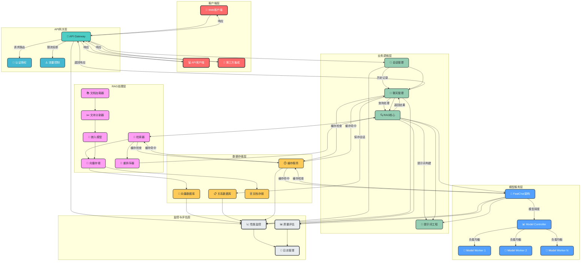
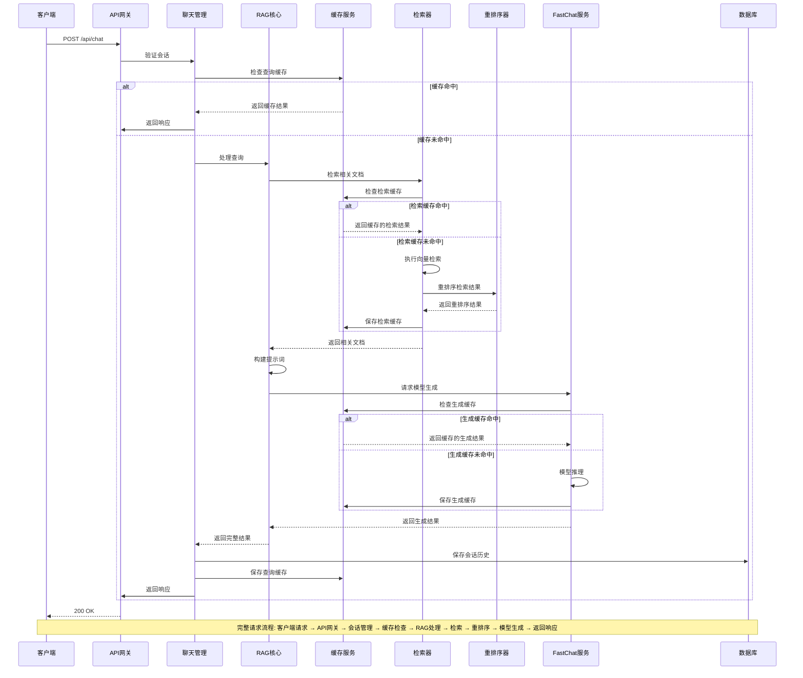
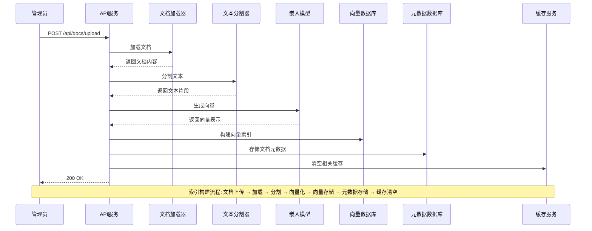
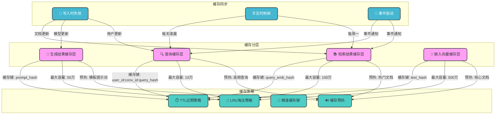
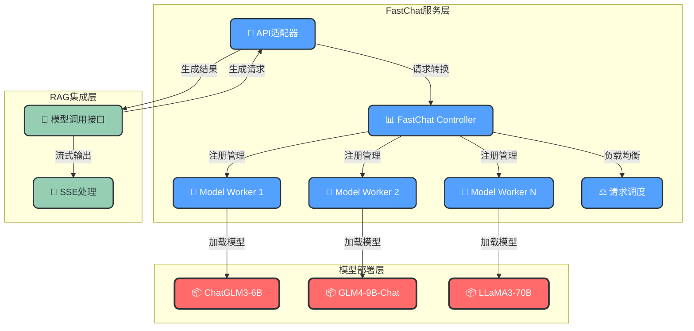
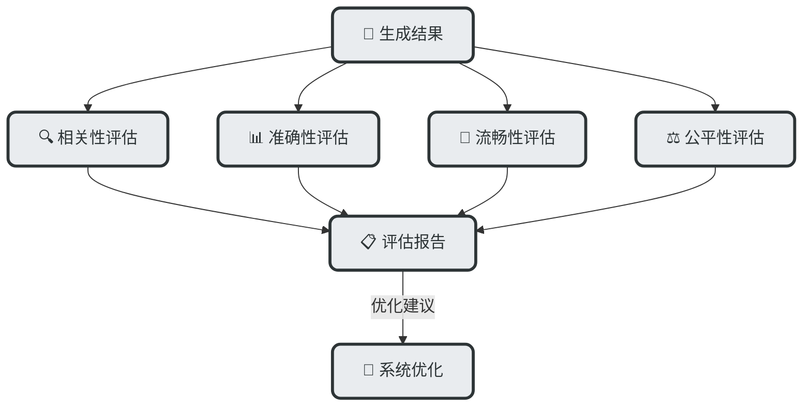
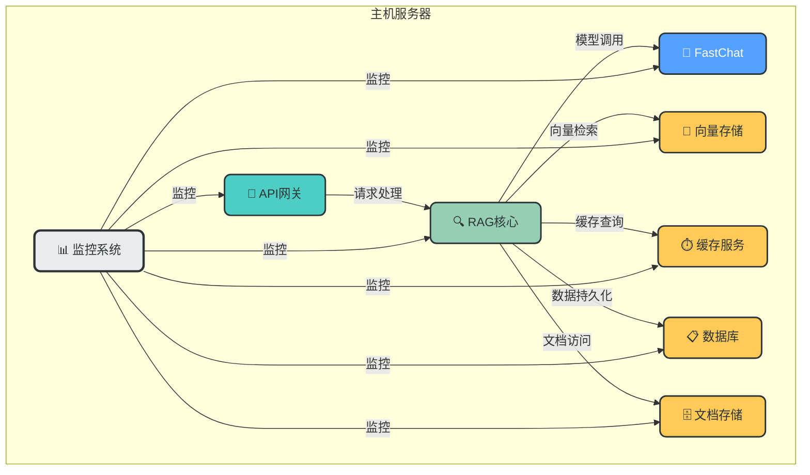
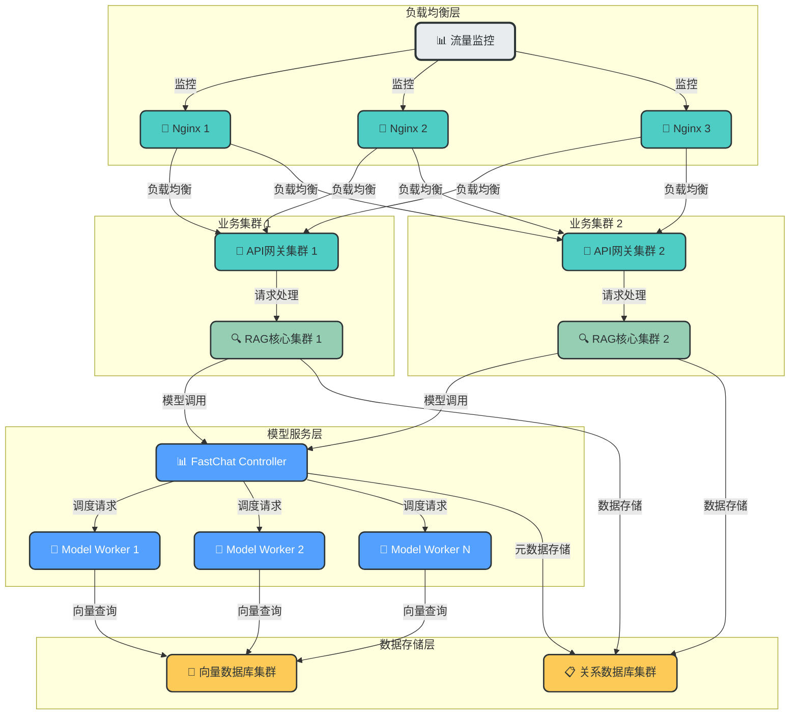

# 完整RAG知识库架构设计

## 1. 系统架构概览

### 1.1 整体架构图



### 1.2 核心组件说明

| 组件 | 主要功能 | 技术选型 |
|------|---------|----------|
| **API网关** | 请求路由、认证授权、流量控制 | FastAPI + JWT + Redis |
| **会话管理** | 管理用户会话、历史记录 | Redis + MySQL |
| **聊天管理** | 处理聊天请求、构建上下文 | Python + SQLAlchemy |
| **RAG核心** | 协调检索、生成、评估流程 | 自定义Python模块 |
| **文档加载器** | 支持多种文档格式加载 | LangChain Document Loaders |
| **文本分割器** | 智能分割文本为片段 | LangChain Text Splitters |
| **嵌入模型** | 文本向量化转换 | HuggingFace Embeddings |
| **向量存储** | 向量索引构建与管理 | FAISS / Milvus |
| **检索器** | 相似文档检索 | 自定义Retriever + LangChain |
| **重排序器** | 优化检索结果排序 | BGE-Reranker |
| **FastChat架构** | 大模型管理与调度 | FastChat |
| **提示词工程** | 动态构建高质量提示词 | 自定义Prompt Templates |
| **缓存服务** | 加速检索与生成 | Redis |

## 2. 完整请求响应流程

### 2.1 用户请求处理流程



### 2.2 文档索引构建流程



## 3. 缓存机制设计

### 3.1 缓存分层架构



### 3.2 缓存键设计

| 缓存类型 | 缓存键格式 | 过期时间 | 最大容量 |
|---------|-----------|----------|----------|
| 查询缓存 | `user:{user_id}:conv:{conv_id}:query:{query_hash}` | 24小时 | 10万 |
| 检索结果缓存 | `retrieval:{query_emb_hash}:topk:{topk}` | 7天 | 100万 |
| 生成结果缓存 | `generation:{prompt_hash}:model:{model_name}` | 14天 | 50万 |
| 嵌入向量缓存 | `embedding:{text_hash}:model:{model_name}` | 30天 | 500万 |
| 会话缓存 | `session:{user_id}:conv:{conv_id}` | 1小时 | 100万 |

### 3.3 缓存实现示例

```python
# 缓存服务实现
import redis
import hashlib
import json
from typing import Any, Optional

class CacheService:
    def __init__(self, host: str = "localhost", port: int = 6379, db: int = 0):
        self.redis_client = redis.Redis(host=host, port=port, db=db, decode_responses=True)
    
    def _generate_hash(self, data: Any) -> str:
        """生成数据的哈希值作为缓存键"""
        if isinstance(data, str):
            return hashlib.md5(data.encode()).hexdigest()
        else:
            return hashlib.md5(json.dumps(data, sort_keys=True).encode()).hexdigest()
    
    def get(self, cache_key: str) -> Optional[Any]:
        """获取缓存数据"""
        try:
            value = self.redis_client.get(cache_key)
            if value:
                return json.loads(value)
            return None
        except Exception as e:
            print(f"Cache get error: {e}")
            return None
    
    def set(self, cache_key: str, value: Any, expire_seconds: int) -> bool:
        """设置缓存数据"""
        try:
            self.redis_client.setex(cache_key, expire_seconds, json.dumps(value, ensure_ascii=False))
            return True
        except Exception as e:
            print(f"Cache set error: {e}")
            return False
    
    def delete(self, cache_key: str) -> bool:
        """删除缓存数据"""
        try:
            self.redis_client.delete(cache_key)
            return True
        except Exception as e:
            print(f"Cache delete error: {e}")
            return False
    
    def delete_pattern(self, pattern: str) -> bool:
        """删除匹配模式的缓存数据"""
        try:
            keys = self.redis_client.keys(pattern)
            if keys:
                self.redis_client.delete(*keys)
            return True
        except Exception as e:
            print(f"Cache delete pattern error: {e}")
            return False
```

## 3. FastChat模型管理设计

### 3.1 FastChat架构集成



### 3.2 FastChat服务启动配置

```bash
# 1. 启动Controller
gunicorn -w 1 -b 0.0.0.0:20001 fastchat.serve.controller:app

# 2. 启动Model Worker (ChatGLM3-6B)
python -m fastchat.serve.model_worker \
    --model-path /path/to/chatglm3-6b \
    --model-names chatglm3-6b \
    --controller http://localhost:20001 \
    --port 20002 \
    --device cuda

# 3. 启动Model Worker (GLM4-9B-Chat)
python -m fastchat.serve.model_worker \
    --model-path /path/to/glm4-9b-chat \
    --model-names glm4-9b-chat \
    --controller http://localhost:20001 \
    --port 20003 \
    --device cuda

# 4. 启动OpenAI API服务
python -m fastchat.serve.openai_api_server \
    --controller http://localhost:20001 \
    --host 0.0.0.0 \
    --port 8000
```

### 3.3 FastChat模型调用实现

```python
# FastChat模型服务调用实现
import requests
import json
from typing import List, Dict, Optional

class FastChatService:
    def __init__(self, base_url: str = "http://localhost:8000"):
        self.base_url = base_url
        self.headers = {
            "Content-Type": "application/json"
        }
    
    def generate(self, messages: List[Dict], model: str = "chatglm3-6b", 
                temperature: float = 0.7, max_tokens: int = 1024, 
                stream: bool = False) -> Dict:
        """调用FastChat生成文本"""
        url = f"{self.base_url}/v1/chat/completions"
        payload = {
            "model": model,
            "messages": messages,
            "temperature": temperature,
            "max_tokens": max_tokens,
            "stream": stream
        }
        
        try:
            response = requests.post(url, headers=self.headers, json=payload)
            response.raise_for_status()
            return response.json()
        except Exception as e:
            print(f"FastChat generate error: {e}")
            return {"error": str(e)}
    
    def get_models(self) -> List[str]:
        """获取可用模型列表"""
        url = f"{self.base_url}/v1/models"
        try:
            response = requests.get(url, headers=self.headers)
            response.raise_for_status()
            models = response.json().get("data", [])
            return [model["id"] for model in models]
        except Exception as e:
            print(f"FastChat get models error: {e}")
            return []

# 示例使用
fastchat_service = FastChatService()
messages = [
    {"role": "system", "content": "你是一个帮助用户的助手。"},
    {"role": "user", "content": "什么是RAG？"}
]
response = fastchat_service.generate(messages, model="chatglm3-6b")
print(response["choices"][0]["message"]["content"])
```

## 4. 关键组件实现示例

### 4.1 RAG核心处理实现

```python
# RAG核心处理实现
class RAGCore:
    def __init__(self, retriever, reranker, fastchat_service, cache_service, prompt_template):
        self.retriever = retriever
        self.reranker = reranker
        self.fastchat_service = fastchat_service
        self.cache_service = cache_service
        self.prompt_template = prompt_template
    
    def process_query(self, query: str, user_id: str, conv_id: str, model_name: str = "chatglm3-6b") -> Dict:
        """处理用户查询，执行完整RAG流程"""
        # 1. 检查查询缓存
        query_hash = hashlib.md5(query.encode()).hexdigest()
        cache_key = f"user:{user_id}:conv:{conv_id}:query:{query_hash}"
        cached_result = self.cache_service.get(cache_key)
        if cached_result:
            return cached_result
        
        # 2. 执行检索
        retrieval_cache_key = f"retrieval:{query_hash}:topk:5"
        retrieved_docs = self.cache_service.get(retrieval_cache_key)
        
        if not retrieved_docs:
            # 2.1 向量检索
            retrieved_docs = self.retriever.retrieve(query, topk=10)
            # 2.2 重排序
            retrieved_docs = self.reranker.rerank(query, retrieved_docs, topk=5)
            # 2.3 保存检索缓存
            self.cache_service.set(retrieval_cache_key, retrieved_docs, expire_seconds=7*24*3600)
        
        # 3. 构建提示词
        prompt = self.prompt_template.build_prompt(query, retrieved_docs)
        
        # 4. 调用模型生成
        messages = [
            {"role": "system", "content": "你是一个基于给定文档回答问题的助手。"},
            {"role": "user", "content": prompt}
        ]
        
        # 4.1 检查生成缓存
        prompt_hash = hashlib.md5(prompt.encode()).hexdigest()
        generation_cache_key = f"generation:{prompt_hash}:model:{model_name}"
        generated_result = self.cache_service.get(generation_cache_key)
        
        if not generated_result:
            # 4.2 调用FastChat生成
            generated_result = self.fastchat_service.generate(messages, model=model_name)
            # 4.3 保存生成缓存
            self.cache_service.set(generation_cache_key, generated_result, expire_seconds=14*24*3600)
        
        # 5. 构建最终结果
        result = {
            "query": query,
            "answer": generated_result["choices"][0]["message"]["content"],
            "retrieved_docs": retrieved_docs,
            "model": model_name,
            "timestamp": int(time.time())
        }
        
        # 6. 保存查询缓存
        self.cache_service.set(cache_key, result, expire_seconds=24*3600)
        
        return result
```

### 4.2 提示词模板实现

```python
# 提示词模板实现
class PromptTemplate:
    def __init__(self, system_prompt: str):
        self.system_prompt = system_prompt
    
    def build_prompt(self, query: str, retrieved_docs: List[Dict]) -> str:
        """根据查询和检索结果构建提示词"""
        # 构建参考文档部分
        references = ""
        for i, doc in enumerate(retrieved_docs):
            references += f"[{i+1}] {doc['content']}\n\n"
        
        # 构建完整提示词
        prompt = f"{self.system_prompt}\n\n"
        prompt += f"参考文档：\n{references}\n"
        prompt += f"问题：{query}\n"
        prompt += "请基于参考文档回答问题，保持答案简洁准确。如果参考文档中没有相关信息，请说'根据提供的参考文档，无法回答该问题。'\n"
        prompt += "回答："
        
        return prompt
```

## 5. 性能优化策略

### 5.1 检索优化
- **向量索引优化**：使用FAISS的IVF索引或HNSW索引加速检索
- **批次检索**：支持批量查询处理，提高吞吐量
- **多级检索**：先使用粗检索过滤大量文档，再使用精检索优化结果
- **检索缓存**：缓存高频查询的检索结果

### 5.2 生成优化
- **模型量化**：使用8-bit或4-bit量化减少模型内存占用
- **模型并行**：对于大模型，使用张量并行或流水线并行加速推理
- **生成缓存**：缓存高频提示词的生成结果
- **流式输出**：支持SSE流式输出，提高用户体验

### 5.3 系统优化
- **异步处理**：使用异步框架处理并发请求
- **连接池**：数据库和Redis连接池管理
- **负载均衡**：FastChat Controller的请求调度优化
- **监控告警**：实时监控系统性能，及时发现并处理问题

## 6. 监控与评估

### 6.1 监控指标

| 指标类型 | 具体指标 | 监控频率 |
|---------|---------|----------|
| **系统性能** | API响应时间、并发请求数、错误率 | 每秒 |
| **检索性能** | 检索延迟、检索准确率、召回率 | 每分钟 |
| **生成性能** | 生成延迟、生成质量、token生成速度 | 每分钟 |
| **缓存性能** | 缓存命中率、缓存大小、缓存更新频率 | 每分钟 |
| **资源利用率** | CPU使用率、内存使用率、GPU使用率 | 每5秒 |

### 6.2 质量评估



### 6.3 评估实现示例

```python
# 简单的生成质量评估实现
class Evaluator:
    def __init__(self, model_name: str = "chatglm3-6b"):
        self.model_name = model_name
        self.fastchat_service = FastChatService()
    
    def evaluate_relevance(self, query: str, answer: str, retrieved_docs: List[Dict]) -> float:
        """评估回答与查询的相关性"""
        # 构建评估提示词
        prompt = f"评估以下回答与问题的相关性，使用0-10分评分，0分完全不相关，10分完全相关。\n"
        prompt += f"问题：{query}\n"
        prompt += f"回答：{answer}\n"
        prompt += "请只返回数字评分，不要添加任何其他内容。"
        
        messages = [{"role": "user", "content": prompt}]
        response = self.fastchat_service.generate(messages, model=self.model_name)
        
        try:
            score = float(response["choices"][0]["message"]["content"].strip())
            return score / 10.0  # 转换为0-1范围
        except:
            return 0.0
    
    def evaluate_accuracy(self, answer: str, ground_truth: str) -> float:
        """评估回答的准确性"""
        # 构建评估提示词
        prompt = f"评估以下回答与标准答案的准确性，使用0-10分评分，0分完全错误，10分完全正确。\n"
        prompt += f"标准答案：{ground_truth}\n"
        prompt += f"回答：{answer}\n"
        prompt += "请只返回数字评分，不要添加任何其他内容。"
        
        messages = [{"role": "user", "content": prompt}]
        response = self.fastchat_service.generate(messages, model=self.model_name)
        
        try:
            score = float(response["choices"][0]["message"]["content"].strip())
            return score / 10.0  # 转换为0-1范围
        except:
            return 0.0
```

## 7. 部署架构

### 7.1 单机部署架构

适合开发和测试环境，所有组件部署在同一台机器上：



### 7.2 分布式部署架构

适合生产环境，组件分布式部署，提高系统可靠性和扩展性：



## 8. 总结

本设计提供了一个完整的RAG知识库架构，具有以下特点：

1. **模块化设计**：清晰的组件划分，便于维护和扩展
2. **完整的请求响应流程**：从客户端请求到模型生成的全流程设计
3. **多层缓存机制**：检索缓存、生成缓存、嵌入缓存等，加速系统响应
4. **FastChat集成**：成熟的大模型管理和调度架构
5. **性能优化策略**：检索优化、生成优化、系统优化多管齐下
6. **监控与评估**：全面的监控指标和质量评估机制
7. **灵活的部署架构**：支持单机和分布式部署

这个架构设计可以作为构建生产级RAG知识库系统的参考，根据具体业务需求和资源情况进行调整和优化。