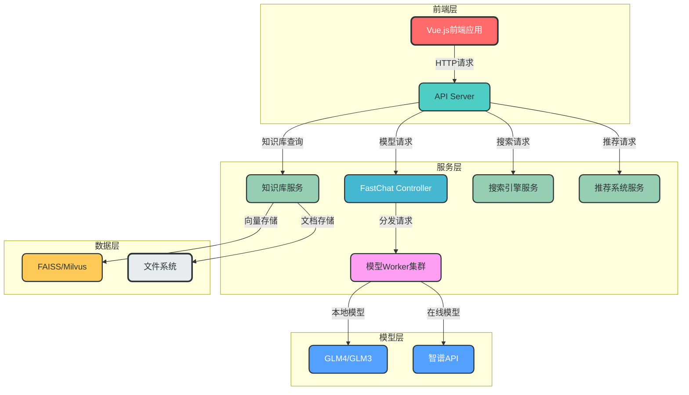
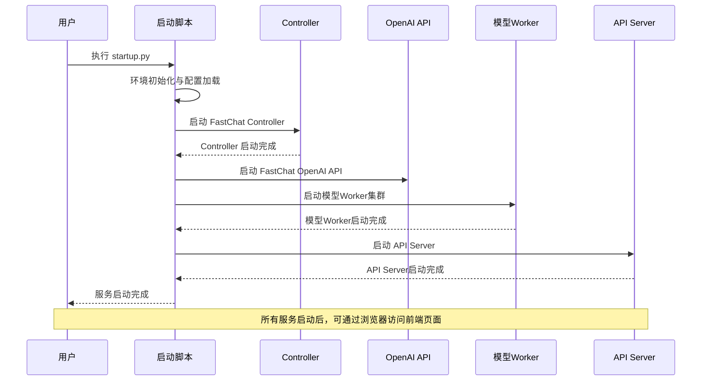
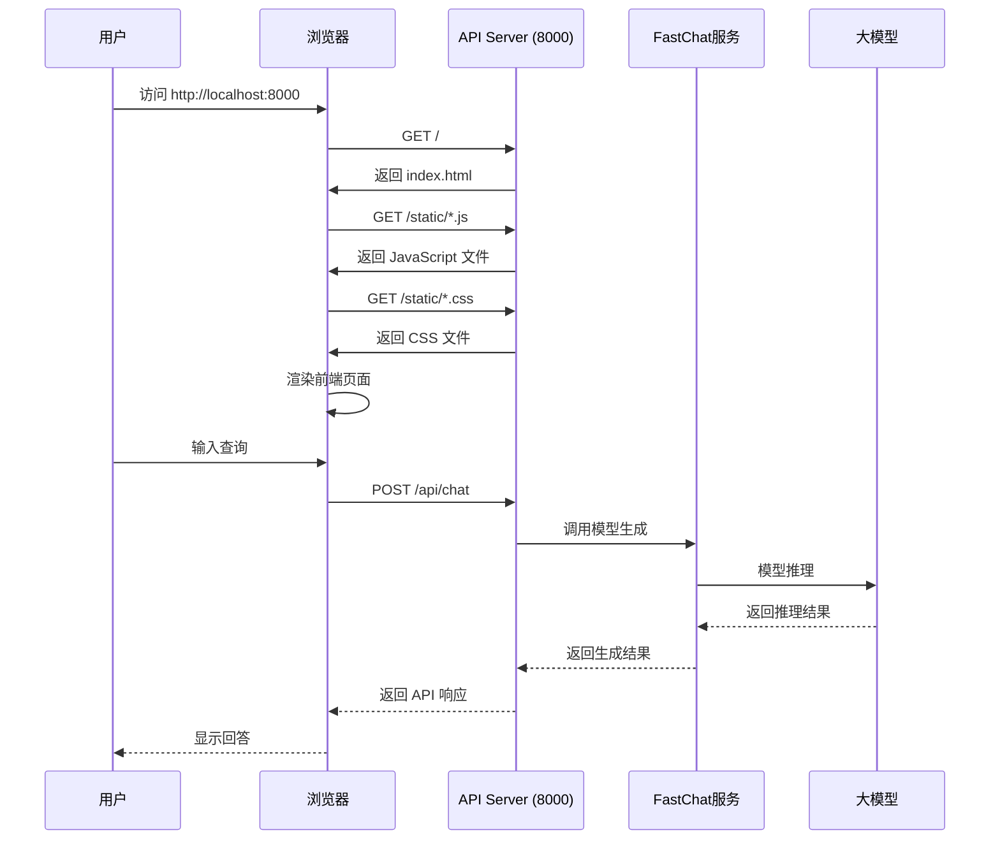

# 服务启动与前端访问指南

## 1. 项目概述

fufan-chat-api 是一个基于 FastAPI 和 FastChat 构建的智能聊天 API 服务，支持多种大模型对话、知识库问答、搜索引擎集成和推荐系统等功能。项目包含完整的前后端架构，可通过启动服务后直接访问前端页面进行交互。

## 2. 项目架构

### 2.1 整体架构图



### 2.2 核心组件说明

| 组件 | 作用 | 技术栈 | 配置文件 |
|------|------|--------|----------|
| API Server | 统一接口入口，静态文件服务 | FastAPI | configs/server_config.py |
| FastChat Controller | 模型请求分发，Worker管理 | FastChat | configs/server_config.py |
| 模型Worker | 大模型推理服务 | FastChat | configs/server_config.py |
| 知识库服务 | 文档向量检索，问答生成 | LangChain | server/knowledge_base/ |
| 前端应用 | 用户交互界面 | Vue.js + Element UI | static/dist/ |

## 3. 前端应用分析

### 3.1 前端存在证据

从项目文件结构和代码分析，该项目**确实存在前端**，具体证据如下：

#### 3.1.1 前端文件位置
- 前端静态资源存放在 `/static/dist/` 目录下
- 入口文件：`/static/dist/index.html`
- 包含多个 JavaScript 模块和 CSS 样式文件

#### 3.1.2 前端技术栈
- **Vue.js**：从 `index.html` 中可以看到引入了 Vue 相关的 JavaScript 文件
- **Element UI**：引入了 Element UI 组件库
- **vxe-table**：引入了 vxe-table 表格组件库
- **现代 JavaScript 模块**：使用 `<script type="module">` 加载资源

### 3.2 前端访问配置

#### 3.2.1 API Server 配置
从 `server_config.py` 中可以看到 API Server 的默认配置：
```python
API_SERVER = {
    "host": DEFAULT_BIND_HOST,  # 默认是 "0.0.0.0"（非Windows）或 "127.0.0.1"（Windows）
    "port": 8000,
}
```

#### 3.2.2 静态文件挂载
从 `api_router.py` 中可以看到前端静态文件的挂载配置：
```python
# 挂载 Vue 构建的前端静态文件夹
app.mount("/", StaticFiles(directory="static/dist"), name="static")
```

这意味着**根路径 `/` 会指向前端静态文件目录**，访问 API Server 的根路径就可以直接访问前端页面。

#### 3.2.3 访问地址
根据配置，前端页面的访问地址为：
- **非Windows系统**：`http://0.0.0.0:8000`
- **Windows系统**：`http://127.0.0.1:8000`
- **本地访问**：`http://localhost:8000`

## 4. 服务启动流程

### 4.1 启动脚本分析

服务启动的核心逻辑位于 `startup.py` 文件中，主要包含以下步骤：

1. **环境初始化**：设置 Python 环境变量，解决 TP_NUM_C_BUFS 错误
2. **配置加载**：读取模型、服务器等配置信息
3. **进程创建**：创建多个子进程分别运行不同服务
4. **服务启动**：按照特定顺序启动各服务组件

### 4.2 服务启动顺序



### 4.3 启动命令

```bash
# 基本启动命令
python startup.py

# 指定模型启动
python startup.py -m --model-name glm4-9b-chat chatglm3-6b
```

## 5. 前端访问流程

### 5.1 前端请求时序图



### 5.2 主要API接口

| 接口路径 | 方法 | 功能描述 | 标签 |
|----------|------|----------|------|
| /api/chat | POST | 大模型对话交互 | Chat |
| /api/chat/knowledge_base_chat | POST | 知识库问答 | Chat |
| /api/chat/search_engine_chat | POST | 搜索引擎问答 | Chat |
| /api/chat/recommend_chat | POST | 推荐系统交互 | Chat |
| /api/chat/agent_chat | POST | Agent对话能力 | Chat |
| /api/users/register | POST | 用户注册 | Users |
| /api/users/login | POST | 用户登录 | Users |
| /api/knowledge-bases/{user_id} | GET | 获取知识库列表 | Knowledge Management |

## 6. 常见问题与解决方案

### 6.1 TP_NUM_C_BUFS 错误

**问题**：在 MinGW 环境下启动服务时，可能会遇到 TP_NUM_C_BUFS 相关错误

**解决方案**：
1. 使用 Windows 命令提示符或 PowerShell 替代 MinGW
2. 服务启动脚本中已包含错误处理机制，会自动尝试替代启动方式
3. 直接使用 uvicorn 命令启动特定服务

```bash
# 直接启动 Controller 示例
python -m uvicorn fastchat.serve.controller:app --host=0.0.0.0 --port=20001 --log-level=debug
```

### 6.2 前端页面无法访问

**问题**：启动服务后，无法通过浏览器访问前端页面

**排查步骤**：
1. 检查服务是否正常启动，查看控制台输出
2. 确认 API Server 监听地址和端口是否正确
3. 检查防火墙设置，确保端口 8000 已开放
4. 尝试使用 IP 地址替代 localhost 访问

### 6.3 模型请求超时

**问题**：发送模型请求后，长时间没有响应或返回超时错误

**解决方案**：
1. 检查 HTTPX_DEFAULT_TIMEOUT 配置，适当增大超时时间
2. 确认模型 Worker 服务是否正常运行
3. 检查模型加载状态，确保模型已成功加载

## 7. 总结

fufan-chat-api 项目是一个功能完整的智能聊天 API 服务，包含：

1. **完整的前后端架构**：前端基于 Vue.js 开发，后端基于 FastAPI 和 FastChat 构建
2. **多模型支持**：支持本地模型（GLM4/GLM3）和在线模型（智谱API）
3. **丰富的功能模块**：包含大模型对话、知识库问答、搜索引擎和推荐系统
4. **便捷的访问方式**：启动服务后即可通过浏览器访问前端页面

通过本指南，您可以了解项目的整体架构、前端访问方式和服务启动流程，快速上手使用 fufan-chat-api 服务。

## 8. 参考文档

- [FastAPI 官方文档](https://fastapi.tiangolo.com/)
- [FastChat 官方文档](https://github.com/lm-sys/FastChat)
- [Vue.js 官方文档](https://vuejs.org/)
- [Element UI 官方文档](https://element-plus.org/)
